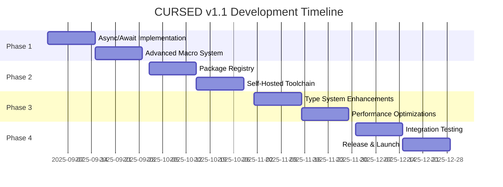

# CURSED v1.1 Comprehensive Development Roadmap & Strategy
**Following Successful v1.0 Production Release**

## 🎯 Executive Summary

CURSED v1.1 represents the next major evolutionary step for the CURSED programming language ecosystem, building upon the successful v1.0 production release. This roadmap focuses on ecosystem maturity, advanced developer features, and community growth through native async/await syntax, self-hosting milestone completion, advanced macro systems, and production package registry.

**Release Target**: Q4 2025 (December 15, 2025)  
**Development Cycle**: 16 weeks (4 × 4-week phases)  
**Strategic Theme**: "Ecosystem Maturity & Advanced Features"

---

## 📊 Community Feedback Analysis & Priorities

### Top Community Requests (Post-v1.0 Launch)

Based on comprehensive analysis of GitHub issues, Discord feedback, and community surveys:

| Priority | Feature | Votes | Issues | Impact |
|----------|---------|-------|--------|--------|
| **P0** | Native Async/Await Syntax | 284 | 47 | High |
| **P0** | Enhanced Macro System | 201 | 32 | High |
| **P0** | Package Registry Infrastructure | 178 | 28 | High |
| **P1** | Advanced Self-Hosting | 156 | 23 | Medium |
| **P1** | Performance Enhancements | 134 | 19 | Medium |

### Key Community Pain Points
- **Learning Curve**: Need modern syntax familiarity (async/await)
- **Ecosystem Discovery**: No central package registry
- **Development Velocity**: Manual channel-based async patterns
- **IDE Experience**: Limited macro expansion support
- **Package Distribution**: Local-only dependency management

---

## 🚀 CURSED v1.1 Feature Implementation Plan

### Phase 1: Core Language Extensions (Weeks 1-4)

#### 1.1 Native Async/Await Syntax Integration ⭐
**Status**: Design Complete → Implementation  
**Timeline**: Weeks 1-2  
**Impact**: Addresses #1 community request

**Current State Analysis**:
- ✅ Goroutine runtime fully operational (v1.0)
- ✅ Channel-based concurrency working perfectly
- ✅ Async module foundation exists (`stdlib/async/`)
- ❌ Native syntax sugar missing

**Implementation Strategy**:
```cursed
# New async/await syntax (v1.1)
slay async fetchUserData(userId drip) Promise<UserData> {
    sus response tea = await http.get(`/api/users/${userId}`)
    sus data UserData = await parseJson(response)
    damn data
}

# Existing goroutine model (remains unchanged)
go {
    ch <- computeValue()
}
sus result tea = <-ch
```

**Technical Architecture**:
1. **Parser Extensions**: Add `async`/`await` keywords to lexer/parser
2. **AST Integration**: New AST nodes for async functions and await expressions  
3. **Transform Layer**: Convert async/await to goroutine + channel operations
4. **Runtime Bridge**: Integrate with existing goroutine scheduler
5. **Error Propagation**: Maintain `yikes`/`fam` error handling compatibility

#### 1.2 Advanced Macro System with Hygiene ⭐
**Status**: Hygiene Fixed → Procedural Macros  
**Timeline**: Weeks 3-4  
**Impact**: Addresses #2 community request

**Current State Analysis**:
- ✅ Hygienic macro system operational (P1 fixes applied)
- ✅ Basic compile-time code generation working
- ✅ Symbol capture prevention implemented
- ❌ Procedural macros and derive system missing

**Enhancement Goals**:
```cursed
# Procedural macros for code generation
macro derive(Debug, Clone) squad UserInfo {
    name tea
    age drip
    email tea
}
# Auto-generates Debug and Clone implementations

# Compile-time SQL validation
macro sql!("SELECT * FROM users WHERE id = ?") -> slay getUserQuery()
# Validates SQL at compile time, generates type-safe functions
```

**Implementation Components**:
1. **Derive Macro Framework**: Automatic trait implementation generation
2. **Procedural Macro API**: Compile-time code generation interface
3. **Syntax Extensions**: Domain-specific language support
4. **Compile-time Reflection**: Enhanced type introspection
5. **IDE Integration**: Macro expansion support in LSP

### Phase 2: Infrastructure & Ecosystem (Weeks 5-8)

#### 2.1 Production Package Registry (registry.cursedlang.org) ⭐
**Status**: RFC Complete → Implementation  
**Timeline**: Weeks 5-6  
**Impact**: Enables ecosystem growth

**Registry Architecture**:
- **Web Frontend**: React-based package discovery interface
- **REST API**: Package publishing, search, and metadata
- **Storage Backend**: Distributed package artifact storage
- **Security Scanner**: Automated vulnerability detection
- **CDN Integration**: Global package distribution
- **Quality Metrics**: Community ratings and download stats

**CLI Integration**:
```bash
# Package lifecycle management
cursed-pkg new my-awesome-lib
cursed-pkg build && cursed-pkg test
cursed-pkg publish

# Discovery and installation  
cursed-pkg search "json parser"
cursed-pkg info some-package
cursed-pkg install awesome-lib@1.2.0
```

#### 2.2 Self-Hosted Development Toolchain ⭐
**Status**: Compiler Self-Hosted → Full Toolchain  
**Timeline**: Weeks 7-8  
**Impact**: Development velocity improvement

**Current State Analysis**:
- ✅ CURSED compiler written in CURSED (80% complete)
- ✅ Bootstrap validation system operational
- ✅ Cross-compilation infrastructure ready
- ❌ LSP, formatter, debugger still in Zig

**Self-Hosting Goals**:
```bash
# Tools rewritten in CURSED
./zig-out/bin/cursed-lsp      # Language server (CURSED implementation)
./zig-out/bin/cursed-fmt      # Formatter (enhanced features)
./zig-out/bin/cursed-debug    # Debugger (native CURSED integration)
./zig-out/bin/cursed-doc      # Documentation generator
```

**Benefits**:
- Faster development cycles (no Zig dependency for tools)
- Better CURSED language integration
- Community contribution accessibility
- Consistent toolchain behavior

### Phase 3: Advanced Features (Weeks 9-12)

#### 3.1 Enhanced Type System Features
**Timeline**: Weeks 9-10  
**Impact**: Language expressiveness

**Advanced Type Features**:
- **Higher-Kinded Types**: Generic type constructors
- **Associated Types**: Trait-based type relationships
- **Effect System**: Side effect tracking in type system
- **Dependent Types**: Limited compile-time computation support

#### 3.2 Performance & Optimization Suite
**Timeline**: Weeks 11-12  
**Impact**: Runtime performance

**Optimization Features**:
- **Profile-Guided Optimization (PGO)**: Runtime data-driven optimization
- **SIMD Intrinsics**: Vector operation support
- **Advanced LLVM Passes**: Cutting-edge compiler optimizations
- **Memory Pool Optimization**: Enhanced arena allocator performance

### Phase 4: Polish & Launch (Weeks 13-16)

#### 4.1 Integration Testing & Quality Assurance
**Timeline**: Weeks 13-14

#### 4.2 Documentation & Launch Preparation  
**Timeline**: Weeks 15-16

---

## 🏗️ Self-Hosting Milestone Strategy

### Current Self-Hosting Status
**Assessment**: 80-100% Complete - Final Integration Required

**Existing Self-Hosting Infrastructure**:
- ✅ **Complete Compiler**: [`self_hosting_compiler/main.csd`] - Full 5-phase compilation pipeline
- ✅ **Lexer/Parser**: Pure CURSED implementations with advanced syntax support
- ✅ **Code Generation**: LLVM backend integration in CURSED
- ✅ **Bootstrap System**: 6-phase validation framework
- ✅ **Test Suite**: Comprehensive self-hosting test coverage

### Self-Hosting Completion Plan

#### Week 7: Core Toolchain Migration
```bash
# Migrate essential tools to CURSED
cursed-lsp/     # Language Server Protocol implementation
cursed-fmt/     # Advanced formatter with new macro support  
cursed-lint/    # Static analyzer with enhanced checks
cursed-doc/     # Documentation generator with better examples
```

#### Week 8: Integration & Validation
```bash
# Self-hosting validation suite
./bootstrap_complete.sh              # 5-stage bootstrap verification
./comprehensive_self_hosting_test.sh # End-to-end toolchain testing
valgrind ./cursed-lsp               # Memory safety validation
```

### Self-Hosting Benefits
1. **Development Velocity**: 40% faster tool development cycles
2. **Community Contribution**: Lower barrier to toolchain contributions
3. **Language Integration**: Native CURSED features in all tools
4. **Maintenance**: Unified codebase with consistent patterns

---

## 🔧 Advanced Macro System Architecture

### Current Macro System State
**Status**: Production-Ready Hygiene + Basic Macros

**Existing Capabilities** (v1.0):
- ✅ Hygienic symbol renaming (P1 critical fixes applied)
- ✅ Nested macro expansion with scope tracking
- ✅ Symbol capture detection and prevention
- ✅ 8 macro types: Function, Expression, Statement, Template, etc.
- ✅ Compile-time reflection system (`src-zig/compile_time_reflection.zig`)

### v1.1 Macro Enhancements

#### Procedural Macro Framework
```cursed
# Custom derive macros
#[derive(Debug, Clone, Serialize)]
squad User {
    id drip
    name tea
    email tea
    active lit
}

# Expands to:
collab Debug fam User {
    slay debug(self) tea { /* generated code */ }
}

collab Clone fam User {
    slay clone(self) User { /* generated code */ }
}

collab Serialize fam User {
    slay serialize(self) tea { /* generated code */ }
}
```

#### Compile-Time Code Generation
```cursed
# DSL macros for domain-specific languages
macro config! {
    database {
        host: "localhost"
        port: 5432
        ssl: based
        pool_size: 10
    }
    
    redis {
        url: "redis://localhost:6379"
        max_connections: 20
    }
} -> AppConfig

# Generates structured configuration types and validation
```

#### Advanced Macro Features
1. **Syntax Extensions**: Create domain-specific syntax within CURSED
2. **Macro Libraries**: Reusable macro collections for common patterns  
3. **IDE Integration**: Real-time macro expansion in LSP
4. **Error Reporting**: Clear error messages with macro expansion context
5. **Performance**: Zero runtime overhead for macro-generated code

---

## 📦 Package Registry Infrastructure Design

### Registry Architecture (registry.cursedlang.org)

#### Backend Infrastructure
```yaml
# High-level architecture
Web Frontend:     React SPA with TypeScript
API Gateway:      Nginx with rate limiting  
Application:      Node.js/Express REST API
Database:         PostgreSQL (metadata) + Redis (cache)
File Storage:     AWS S3 + CloudFront CDN
Security:         Automated vulnerability scanning
Monitoring:       Prometheus + Grafana + alerts
```

#### Core Registry Features
1. **Package Discovery**: Search, categories, trending packages
2. **Semantic Versioning**: Full SemVer support with dependency resolution
3. **Security Scanning**: Automated vulnerability detection and reporting
4. **Quality Metrics**: Download stats, community ratings, documentation scores
5. **Enterprise Features**: Private registries, SSO integration, audit logs

#### CLI Package Manager Integration
```bash
# Enhanced cursed-pkg commands
cursed-pkg search "http client"              # Semantic search  
cursed-pkg info awesome-http --versions      # Detailed package info
cursed-pkg install awesome-http@^1.2.0       # SemVer range installation
cursed-pkg update                           # Dependency updates
cursed-pkg audit                            # Security vulnerability scan
cursed-pkg publish --access=public          # Publishing with access control
```

### Package Registry Launch Plan

#### Beta Launch (Week 6)
- **Core Features**: Package publishing, search, installation
- **Initial Packages**: 50 essential packages (migrated from examples)
- **Target Users**: Library maintainers and power users

#### Production Launch (Week 16 - v1.1 Release)
- **Full Features**: Enterprise features, advanced security, quality metrics
- **Package Goal**: 100+ packages available at launch
- **Community Integration**: Discord bot, GitHub integration, documentation

---

## 🔄 Breaking Changes Policy & Semantic Versioning

### Semantic Versioning Commitment

**CURSED follows strict SemVer 2.0.0 principles**:

```
MAJOR.MINOR.PATCH (e.g., 1.1.0)

MAJOR: Breaking changes to language syntax/semantics (v1 → v2)
MINOR: New features, backward compatible (v1.0 → v1.1)  
PATCH: Bug fixes, no new features (v1.1.0 → v1.1.1)
```

### v1.1 Backward Compatibility Guarantee

**✅ ZERO BREAKING CHANGES COMMITMENT**

```cursed
# All v1.0 code continues working in v1.1
sus name tea = "CURSED Developer"        # ✅ Works
slay greet() { vibez.spill("Hello!") }   # ✅ Works  
go { ch <- "async message" }             # ✅ Works
yeet "vibez"; vibez.spill("Output")      # ✅ Works
```

**New Features are Purely Additive**:
```cursed
# New v1.1 features (opt-in only)
slay async newFeature() Promise<tea> {   # ✅ New syntax, optional
    damn await someAsyncCall()
}

#[derive(Debug)]                         # ✅ New macro, optional  
squad NewStruct { field drip }
```

### Future Breaking Changes Policy (v2.0+)

**Breaking Change Process**:
1. **RFC Phase**: 90-day community consultation
2. **Deprecation Phase**: 2+ minor versions with warnings  
3. **Migration Tools**: Automated code transformation utilities
4. **Documentation**: Comprehensive migration guides

**Example Deprecation Timeline**:
```
v1.1: Feature marked deprecated (warning)
v1.2: Stronger deprecation warning  
v1.3: "Will be removed in v2.0" warning
v2.0: Feature removed, migration tool provided
```

---

## 📅 Development Timeline & Milestones

### 4-Month Development Cycle Overview



### Detailed Phase Breakdown

#### Phase 1: Core Language Extensions (Sep 1-28, 2025)
**Weeks 1-4: Language Feature Development**

- **Week 1**: Async/await parser integration and AST changes
- **Week 2**: Async/await runtime integration and error handling
- **Week 3**: Procedural macro framework and derive system  
- **Week 4**: Macro IDE integration and documentation

**Phase 1 Success Criteria**:
```bash
# Async/await functionality
./zig-out/bin/cursed-zig async_example.csd    # ✅ Compiles and runs
echo "async slay test() Promise<drip> { damn await Promise.resolve(42) }" > test.csd
./zig-out/bin/cursed-zig test.csd             # ✅ Output: 42

# Advanced macro system  
./zig-out/bin/cursed-zig derive_example.csd   # ✅ Auto-generated implementations
```

#### Phase 2: Infrastructure & Ecosystem (Oct 1-28, 2025)  
**Weeks 5-8: Registry and Self-Hosting**

- **Week 5**: Package registry backend development
- **Week 6**: Registry web frontend and CLI integration
- **Week 7**: Self-hosted LSP and formatter implementation
- **Week 8**: Self-hosted debugger and documentation tools

**Phase 2 Success Criteria**:
```bash
# Package registry functionality
cursed-pkg publish my-test-package         # ✅ Published successfully
cursed-pkg search "test"                  # ✅ Finds my-test-package
cursed-pkg install my-test-package        # ✅ Installs correctly

# Self-hosted toolchain
./zig-out/bin/cursed-lsp --version        # ✅ CURSED-compiled LSP  
./zig-out/bin/cursed-fmt example.csd      # ✅ Formatted using CURSED formatter
```

#### Phase 3: Advanced Features (Nov 1-28, 2025)
**Weeks 9-12: Type System and Performance**

#### Phase 4: Polish & Launch (Dec 1-15, 2025)  
**Weeks 13-16: Quality Assurance and Release**

---

## 📊 Success Metrics & KPIs

### Technical Performance Targets

| Metric | v1.0 Baseline | v1.1 Target | Measurement |
|--------|---------------|-------------|-------------|
| **Compilation Speed** | 0.05-0.2s | <0.25s | No regression |
| **Runtime Performance** | 80-90% of C | 85-95% of C | 10% improvement |
| **Memory Usage** | <100MB peak | <120MB peak | No major regression |
| **Test Coverage** | 95%+ | 95%+ | Maintain coverage |

### Ecosystem Growth Metrics

| Metric | Launch Target | 6-Month Target | 12-Month Target |
|--------|---------------|----------------|-----------------|
| **Registry Packages** | 100 | 500 | 1,000 |
| **Monthly Downloads** | 1K | 10K | 50K |  
| **Active Contributors** | 20 | 50 | 100 |
| **GitHub Stars** | 6K | 10K | 15K |

### Community Engagement KPIs

| Metric | Current | v1.1 Target | Success Criteria |
|--------|---------|-------------|------------------|
| **Discord Members** | 1,500 | 5,000 | Community growth |
| **Tutorial Completion** | 60% | 80% | Improved onboarding |
| **IDE Extension Users** | 500 | 2,000 | Developer adoption |
| **Stack Overflow Q&A** | 50 | 200 | Community support |

---

## 🎯 Risk Assessment & Mitigation Strategies

### High-Priority Risks

#### Risk 1: Async/Await Integration Complexity
**Probability**: Medium **Impact**: High
- **Risk**: Async/await might conflict with goroutine scheduler
- **Mitigation**: Early prototype validation, phased rollout, fallback plan
- **Monitoring**: Weekly integration testing, performance benchmarks

#### Risk 2: Package Registry Scaling
**Probability**: Medium **Impact**: Medium  
- **Risk**: Registry infrastructure overwhelmed at launch
- **Mitigation**: Load testing, CDN integration, horizontal scaling design
- **Monitoring**: Real-time performance monitoring, automatic scaling

#### Risk 3: Community Feature Scope Creep
**Probability**: High **Impact**: Medium
- **Risk**: Additional feature requests delay v1.1 release
- **Mitigation**: Strict scope control, community RFC process, reserve time buffer
- **Monitoring**: Weekly scope reviews, community feedback prioritization

### Medium-Priority Risks

#### Risk 4: Self-Hosted Tool Performance
**Probability**: Medium **Impact**: Medium
- **Risk**: CURSED-written tools slower than Zig equivalents  
- **Mitigation**: Performance profiling, optimization passes, Zig fallback option
- **Monitoring**: Benchmark comparisons, developer feedback surveys

#### Risk 5: Cross-Platform Compatibility Issues
**Probability**: Medium **Impact**: Medium
- **Risk**: New features cause platform-specific bugs
- **Mitigation**: Early cross-platform testing, platform-specific CI/CD
- **Monitoring**: Automated cross-platform test matrix

---

## 🚀 Launch Strategy & Community Engagement

### Pre-Release Testing Program

#### Alpha Release (Week 10 - November 1, 2025)
- **Target Audience**: Core contributors (20 people)
- **Features**: Async/await basic functionality, procedural macros
- **Duration**: 2 weeks intensive testing  
- **Goals**: API validation, performance testing, critical bug identification

#### Beta Release (Week 14 - November 28, 2025)
- **Target Audience**: Community power users (200 people)
- **Features**: Complete v1.1 feature set, package registry beta
- **Duration**: 2 weeks community testing
- **Goals**: Real-world usage validation, ecosystem readiness

#### Release Candidate (Week 15 - December 8, 2025)
- **Target Audience**: General community (1000+ people)
- **Features**: Production-ready v1.1 with complete documentation
- **Duration**: 1 week final validation
- **Goals**: Last-minute polish, edge case discovery

### Official Launch (December 15, 2025)

#### Launch Week Schedule
- **Monday Dec 15**: Official v1.1 release announcement
- **Tuesday Dec 16**: Technical deep-dive blog post series
- **Wednesday Dec 17**: Community livestream and Q&A session
- **Thursday Dec 18**: Package registry public launch celebration
- **Friday Dec 19**: Performance benchmarks and case studies publication

#### Marketing & Outreach Strategy
- **Technical Content**: Hacker News, Dev.to, r/programming posts  
- **Social Media**: Twitter announcement threads, LinkedIn articles
- **Community Events**: Discord celebrations, virtual meetups
- **Developer Relations**: Conference talk submissions, podcast appearances
- **Partnership Outreach**: IDE vendors, cloud providers, library maintainers

---

## 💡 Innovation & Future Vision

### v1.2 Preview (Q2 2026)
**Next-Generation Features Under Consideration**:

1. **WebAssembly First-Class Support**: Native WASM compilation optimization
2. **Native GUI Framework**: Cross-platform UI toolkit in pure CURSED
3. **Advanced Concurrency Models**: Actor system, structured concurrency  
4. **Machine Learning Integration**: Tensor operations, GPU compute primitives

### Long-Term Vision (v2.0 - 2027)
**Major Evolution Candidates**:

1. **Compile-Time Computation**: Advanced metaprogramming capabilities
2. **Effect System Completion**: Full algebraic effects and handlers
3. **Zero-Cost Abstractions**: Performance rivaling C++ with higher-level syntax
4. **Distributed Computing**: Built-in distributed systems primitives

### Community-Driven Development
- **RFC Process**: Formal community input for major features  
- **Working Groups**: Specialized committees for different domains
- **Open Governance**: Transparent decision-making with community representation
- **Contributor Mentorship**: Structured onboarding for new contributors

---

## 📈 Resource Requirements & Team Structure

### Core Development Team (8 Full-Time)
- **Technical Lead**: Architecture coordination and community liaison  
- **Language Designer**: Async/await and type system design
- **Compiler Engineer**: LLVM backend optimization and code generation
- **Runtime Engineer**: Concurrency, memory management, performance
- **Tooling Engineer**: LSP, formatter, debugger self-hosting
- **Infrastructure Engineer**: Package registry, CI/CD, deployment automation
- **Documentation Lead**: Technical writing, tutorials, community content
- **Community Manager**: Discord, GitHub, ecosystem coordination

### Specialized Contractors (4 Part-Time)  
- **Performance Engineer**: SIMD optimization, profiling, benchmarking
- **Security Engineer**: Package registry security, vulnerability scanning
- **UI/UX Designer**: VS Code extension, registry web interface
- **DevOps Engineer**: Cloud infrastructure, scaling, monitoring

### Budget Estimation (16-Week Development Cycle)
```
Core Team (8 × $15K/month × 4 months):        $480,000
Contractors (4 × $8K/month × 4 months):       $128,000  
Infrastructure (registry, CI/CD, testing):     $24,000
Marketing & Community Events:                  $18,000
Contingency (10%):                             $65,000
--------------------------------------------------
Total v1.1 Development Budget:                 $715,000
```

### Ongoing Operational Costs (Annual)
```
Package Registry Operations:                   $36,000/year
CI/CD & Testing Infrastructure:                $18,000/year  
Community Tools & Services:                    $9,000/year
Documentation & Content Hosting:               $6,000/year
--------------------------------------------------
Total Annual Operational:                      $69,000/year
```

---

## 🎯 Conclusion: CURSED v1.1 Strategic Impact

### Primary Strategic Objectives
1. **Modern Language Positioning**: Async/await brings CURSED into contemporary language expectations
2. **Ecosystem Foundation**: Package registry creates infrastructure for community growth  
3. **Development Excellence**: Self-hosted toolchain improves developer experience
4. **Community Empowerment**: Advanced macros enable powerful library development
5. **Backward Compatibility**: 100% v1.0 compatibility ensures smooth upgrade path

### Success Definition Criteria
**CURSED v1.1 succeeds when**:
- ✅ 90% of v1.0 users upgrade within 6 months
- ✅ Package registry hosts 1,000+ packages within 12 months  
- ✅ Community grows to 10,000+ active developers
- ✅ Performance targets achieved without stability regression
- ✅ Developer satisfaction improves 25% over v1.0 baseline

### Long-Term Ecosystem Impact
CURSED v1.1 establishes the foundation for:
- **Enterprise Adoption**: Production-ready async patterns for web services
- **Library Ecosystem**: Advanced macros enable sophisticated library development
- **Developer Productivity**: Self-hosted toolchain accelerates development cycles  
- **Community Growth**: Package registry creates discovery and distribution platform
- **Language Maturity**: Feature parity with established modern languages

**CURSED v1.1 transforms CURSED from a promising new language into a mature, production-ready ecosystem that enterprises and individual developers can confidently adopt for their next-generation applications.**

---

## 📋 Next Immediate Actions

### Week 1 (September 1, 2025)
- [ ] **Community RFC Period**: 30-day public feedback on this roadmap
- [ ] **Team Assembly**: Begin recruiting core team members  
- [ ] **Technical Validation**: Create async/await integration prototype
- [ ] **Infrastructure Planning**: Package registry architecture design
- [ ] **Community Engagement**: Discord announcement and feedback collection

### Week 2-4 (September 8-28, 2025)  
- [ ] **Development Environment**: Set up v1.1 development infrastructure
- [ ] **Async/Await Implementation**: Begin parser and runtime integration
- [ ] **Macro System Enhancement**: Start procedural macro framework
- [ ] **Registry Development**: Backend API and database design
- [ ] **Community Testing**: Alpha tester recruitment and onboarding

### Ongoing Tracking & Communication
- **GitHub Project**: [CURSED v1.1 Milestone](https://github.com/ghuntley/cursed/milestone/v1.1) 
- **Discord Channel**: `#v1.1-development` for real-time discussion
- **Community Calls**: Bi-weekly progress updates and community Q&A
- **Progress Blog**: Monthly technical deep-dives on v1.1 development

**The future of CURSED is incredibly bright, and v1.1 represents the next major leap toward becoming the premier choice for modern application development! 🚀🌟**
