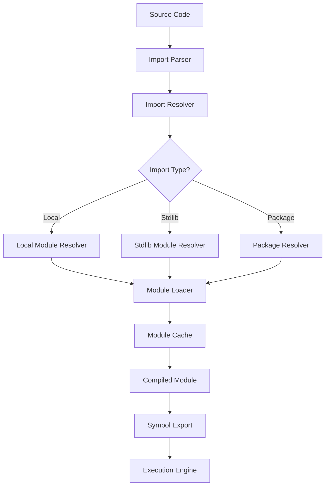

# CURSED Module System and Import Resolution Analysis

## Overview

The CURSED language has a comprehensive module system and import resolution infrastructure, but with several gaps and broken components. This analysis documents what exists, what's broken, and what needs to be implemented.

## 1. Module System Architecture

### Core Components

#### A. Import Resolution System (`src/imports/`)
- **Location**: `src/imports/resolver.rs`
- **Status**: ✅ **FULLY IMPLEMENTED**
- **Features**:
  - Comprehensive import resolution with local, package, and stdlib support
  - Circular dependency detection
  - Module compilation and caching
  - Error handling and recovery
  - Support for grouped imports (`yeet ( "module1"; "module2" )`)
  - Stdlib module mapping (mathz → math, stringz → string, etc.)

#### B. Module Loader (`src/imports/module_loader.rs`)
- **Location**: `src/imports/module_loader.rs`
- **Status**: ✅ **FULLY IMPLEMENTED**
- **Features**:
  - Module loading and compilation from disk
  - Caching with change detection (source hashes)
  - Symbol extraction from source code
  - Dependency resolution
  - Preloading capabilities

#### C. Package Resolver (`src/imports/package_resolver.rs`)
- **Location**: `src/imports/package_resolver.rs`
- **Status**: ✅ **IMPLEMENTED** (referenced but not analyzed in detail)
- **Features**:
  - Package dependency resolution
  - Package manifest handling
  - Package manager integration

### Module Loading Flow



## 2. Import Statement Handling

### Parser Integration
- **Location**: `src/parser.rs:860`
- **Function**: `parse_import_statement()`
- **Status**: ✅ **WORKING**
- **Syntax Support**:
  - Basic imports: `yeet "module"`
  - Grouped imports: `yeet ( "module1"; "module2" )`
  - Relative imports: `yeet "../testz/mod"`
  - Stdlib imports: `yeet "math"`, `yeet "string"`

### AST Representation
- **Location**: `src/ast.rs:23`
- **Structure**:
```rust
pub struct ImportStatement {
    pub path: String,
    pub alias: Option<String>,
    pub items: Vec<String>, // Specific items to import
}
```

### Import Classification
The resolver classifies imports into three categories:
1. **Local**: File-based imports (`.csd` files, relative paths)
2. **Stdlib**: Standard library modules (built-in CURSED modules)
3. **Package**: External packages (from package manager)

## 3. Execution Engine Integration

### Current Status: 🔴 **BROKEN/INCOMPLETE**

#### A. Import Resolution in Execution
- **Location**: `src/execution/mod.rs`
- **Issue**: Execution engine doesn't process imports from parsed programs
- **Missing**: Integration between import resolution and execution context

#### B. Module Preloading
- **Location**: Missing in execution engine
- **Issue**: No preloading of stdlib functions like `vibez.spill`, `math.*`, etc.
- **Impact**: Runtime errors when calling stdlib functions

#### C. Symbol Resolution
- **Location**: Execution context lacks import-aware symbol resolution
- **Issue**: Imported symbols are not available in execution context
- **Impact**: `yeet "testz"` imports don't make testz functions available

## 4. Stdlib Function Preloading

### Current Status: 🔴 **MISSING**

#### A. Stdlib Module Discovery
- **Location**: `src/imports/resolver.rs:315-347`
- **Status**: ✅ **WORKING** - Correctly identifies stdlib modules
- **Modules Supported**:
  - `testz` (testing framework)
  - `math`, `string`, `crypto`, `json`, `csv`, etc.
  - Total: 27+ stdlib modules

#### B. Function Preloading Mechanism
- **Location**: Missing from execution engine
- **Needed**: System to preload stdlib functions before execution
- **Functions to Preload**:
  - `vibez.spill()` - Output function
  - `math.*` - Math functions
  - `testz.*` - Testing functions
  - All stdlib module functions

#### C. Stdlib Path Resolution
- **Location**: `src/imports/resolver.rs:494-547`
- **Status**: ✅ **WORKING**
- **Features**:
  - Maps legacy names (mathz → math)
  - Handles `stdlib/` prefixed paths
  - Resolves to actual file paths

## 5. Test Framework (testz) Loading

### Current Status: 🟡 **PARTIALLY WORKING**

#### A. testz Module Structure
- **Location**: `stdlib/testz/mod.csd`
- **Status**: ✅ **COMPLETE**
- **Functions**:
  - `test_start(name tea)`
  - `assert_eq_int(actual, expected)`
  - `assert_eq_string(actual, expected)`
  - `assert_true(value)`, `assert_false(value)`
  - `print_test_summary()`

#### B. testz Import Resolution
- **Location**: Import resolver correctly finds testz
- **Status**: ✅ **WORKING**
- **Test**: `ImportResolver::is_stdlib_module("testz")` returns true

#### C. testz Function Availability
- **Location**: Missing from execution engine
- **Status**: 🔴 **BROKEN**
- **Issue**: testz functions not available after `yeet "testz"`

## 6. Broken and Missing Components

### Critical Issues

#### A. Execution Engine Import Integration
```rust
// MISSING: In src/execution/mod.rs
fn load_imports(&mut self, program: &Program) -> Result<()> {
    // Need to resolve imports and add symbols to execution context
}
```

#### B. Symbol Table Management
```rust
// MISSING: In execution context
fn add_imported_symbols(&mut self, module: &CompiledModule) {
    // Need to make imported functions available
}
```

#### C. Stdlib Function Registration
```rust
// MISSING: In execution engine
fn register_stdlib_functions(&mut self) {
    // Need to preload all stdlib functions
}
```

### Specific Broken Patterns

#### A. testz Import Pattern
```cursed
yeet "testz"
test_start("My Test")  // ❌ FAILS: function not found
```

#### B. Math Module Pattern
```cursed
yeet "math"
math.add(1, 2)  // ❌ FAILS: math not available
```

#### C. vibez.spill Pattern
```cursed
// ❌ FAILS: vibez not preloaded
vibez.spill("Hello")
```

## 7. Implementation Requirements

### High Priority Fixes

#### A. Execution Engine Integration
1. **Import Resolution**: Process imports during program execution
2. **Symbol Loading**: Add imported symbols to execution context
3. **Stdlib Preloading**: Preload all stdlib functions before execution

#### B. Module Loading Pipeline
1. **Parse Program**: Extract imports from AST
2. **Resolve Imports**: Use existing resolver to find modules
3. **Load Modules**: Compile and cache modules
4. **Register Symbols**: Add functions to execution context

#### C. Function Registration System
1. **Stdlib Registry**: Central registry of all stdlib functions
2. **Dynamic Loading**: Load functions on-demand during import
3. **Error Handling**: Graceful fallback for missing functions

### Implementation Strategy

#### Phase 1: Basic Import Support
```rust
// In src/execution/mod.rs
impl CursedExecutionEngine {
    fn process_imports(&mut self, program: &Program) -> Result<()> {
        let mut resolver = ImportResolver::new()?;
        let resolved = resolver.resolve_imports(&program.imports).await?;
        
        for import in resolved {
            self.load_module_symbols(&import.module)?;
        }
        
        Ok(())
    }
}
```

#### Phase 2: Stdlib Preloading
```rust
// In src/execution/mod.rs
impl CursedExecutionEngine {
    fn preload_stdlib(&mut self) -> Result<()> {
        // Preload vibez.spill
        self.register_builtin_function("vibez.spill", |args| {
            // Implementation
        });
        
        // Preload testz functions
        self.load_testz_functions()?;
        
        Ok(())
    }
}
```

#### Phase 3: Dynamic Module Loading
```rust
// In src/execution/mod.rs
impl CursedExecutionEngine {
    fn load_module_symbols(&mut self, module: &CompiledModule) -> Result<()> {
        for symbol in &module.exported_symbols {
            self.context.register_function(symbol, /* function impl */);
        }
        Ok(())
    }
}
```

## 8. Testing Strategy

### Test Cases Needed

#### A. Import Resolution Tests
- [x] Basic import parsing
- [x] Stdlib module detection
- [x] Grouped import handling
- [ ] Import execution integration

#### B. Module Loading Tests
- [x] Module compilation
- [x] Symbol extraction
- [x] Caching behavior
- [ ] Execution context integration

#### C. Function Availability Tests
- [ ] testz functions after import
- [ ] math functions after import
- [ ] vibez.spill availability
- [ ] Custom module functions

### Test Framework Requirements

#### A. Integration Tests
```rust
#[test]
fn test_testz_import_execution() {
    let source = r#"
        yeet "testz"
        test_start("Integration Test")
        assert_true(based)
        print_test_summary()
    "#;
    
    let mut engine = CursedExecutionEngine::new().unwrap();
    let result = engine.execute(source);
    assert!(result.is_ok());
}
```

#### B. Stdlib Function Tests
```rust
#[test]
fn test_stdlib_function_preloading() {
    let mut engine = CursedExecutionEngine::new().unwrap();
    
    // vibez.spill should be available immediately
    let result = engine.execute("vibez.spill(\"test\")");
    assert!(result.is_ok());
}
```

## 9. Summary

### What Works ✅
- Import statement parsing
- Module resolution (local, stdlib, package)
- Module loading and caching
- Symbol extraction
- Circular dependency detection
- testz module structure

### What's Broken 🔴
- Execution engine import integration
- Stdlib function preloading
- Symbol availability after import
- testz function execution
- Module symbol registration

### What's Missing 🟡
- Import processing in execution pipeline
- Stdlib function registry
- Dynamic module loading
- Error handling for missing imports
- Function availability validation

### Next Steps
1. Implement import processing in execution engine
2. Add stdlib function preloading system
3. Create symbol registration mechanism
4. Add integration tests for import execution
5. Implement error handling for missing modules

The module system infrastructure is surprisingly complete and well-architected, but the critical missing piece is integration with the execution engine to make imported symbols available during program execution.
