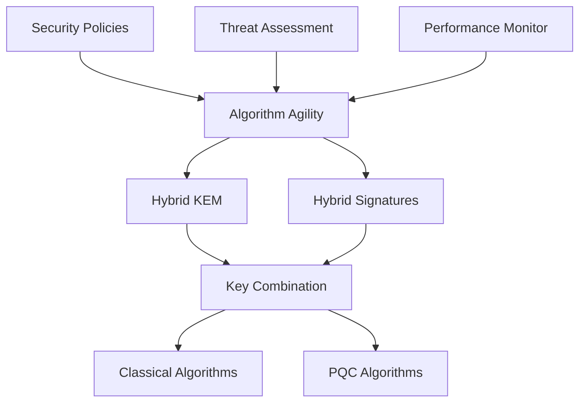

# CURSED Post-Quantum Cryptography Hybrid System

## Overview

The CURSED Post-Quantum Cryptography (PQC) Hybrid System provides a comprehensive cryptographic framework that combines classical and quantum-resistant algorithms for maximum security during the post-quantum transition period. This system is designed to protect against both current classical attacks and future quantum computer threats.

## Table of Contents

1. [Architecture](#architecture)
2. [Hybrid Key Encapsulation](#hybrid-key-encapsulation)
3. [Hybrid Digital Signatures](#hybrid-digital-signatures)
4. [Algorithm Agility Framework](#algorithm-agility-framework)
5. [Security Analysis](#security-analysis)
6. [Performance Characteristics](#performance-characteristics)
7. [Migration Strategy](#migration-strategy)
8. [API Reference](#api-reference)
9. [Examples](#examples)
10. [Best Practices](#best-practices)
11. [Testing](#testing)

## Architecture

### Core Components



The hybrid system consists of several key components:

- **Hybrid KEM (Key Encapsulation Mechanism)**: Combines classical ECDH/X25519 with quantum-resistant KEMs like Kyber
- **Hybrid Digital Signatures**: Combines classical ECDSA/Ed25519 with quantum-resistant signatures like Dilithium
- **Algorithm Agility Framework**: Dynamically selects algorithms based on security policies and threat assessment
- **Security Policy Engine**: Manages algorithm selection rules and deprecation handling
- **Performance Monitor**: Tracks algorithm performance and enables optimization

### Security Model

The hybrid approach provides **defense in depth** by requiring an attacker to break both the classical and post-quantum components:

- **Classical Security**: Protects against current computational threats
- **Quantum Resistance**: Protects against future quantum computer attacks
- **Forward Security**: Ensures long-term protection even if one component is compromised

## Hybrid Key Encapsulation

### Supported Algorithm Combinations

| Classical Algorithm | PQC Algorithm | Security Level | Recommended Use |
|-------------------|---------------|----------------|-----------------|
| X25519 | Kyber512 | Level 1 | General purpose, performance-critical |
| ECDH P-256 | Kyber768 | Level 3 | Standard security applications |
| ECDH P-384 | Kyber1024 | Level 5 | High security, long-term protection |
| ECDH P-521 | Kyber1024 | Level 5 | Maximum security requirements |

### Key Combination Strategies

#### 1. Concatenation
- Simple concatenation of shared secrets
- Fast and straightforward
- Suitable for Level 1 security

#### 2. KDF Combination
- Uses HKDF to combine secrets
- Better security properties
- Recommended for Level 3 security

#### 3. HKDF Combination
- Advanced HKDF with multiple inputs
- Maximum security properties
- Required for Level 5 security

### Usage Example

```rust
use cursed::stdlib::crypto_pqc::hybrid::*;

// Create hybrid KEM
let hybrid_kem = HybridKem::new(
    ClassicalAlgorithm::X25519,
    AlgorithmType::Kyber,
    SecurityLevel::Level3,
);

// Generate key pair
let key_pair = hybrid_kem.keygen()?;

// Encapsulation
let (ciphertext, shared_secret1) = hybrid_kem.encaps(&key_pair)?;

// Decapsulation
let shared_secret2 = hybrid_kem.decaps(&key_pair, &ciphertext)?;

assert_eq!(shared_secret1, shared_secret2);
```

## Hybrid Digital Signatures

### Supported Combinations

| Classical Algorithm | PQC Algorithm | Signature Size | Security Level |
|-------------------|---------------|----------------|----------------|
| Ed25519 | Dilithium2 | ~2.5KB | Level 1 |
| ECDSA P-256 | Dilithium3 | ~3.4KB | Level 3 |
| ECDSA P-384 | Dilithium5 | ~4.7KB | Level 5 |
| Ed25519 | SPHINCS+ | ~30KB | Level 5 (Proven) |

### Signature Combination Methods

#### 1. Concatenation
- Length-prefixed signature concatenation
- Simple and efficient
- Good for most applications

#### 2. Structured Format
- Includes algorithm metadata
- Better for long-term archival
- Supports algorithm identification

#### 3. Composite Scheme
- Cryptographically bound signatures
- Maximum security properties
- Best for critical applications

### Usage Example

```rust
use cursed::stdlib::crypto_pqc::hybrid::*;

// Create hybrid signature system
let hybrid_sig = HybridSignature::new(
    ClassicalSignatureAlgorithm::Ed25519,
    AlgorithmType::Dilithium,
    SecurityLevel::Level3,
);

// Generate signing keys
let key_pair = hybrid_sig.keygen()?;

// Sign message
let message = b"Important document content";
let signature = hybrid_sig.sign(&key_pair, message)?;

// Verify signature
let is_valid = hybrid_sig.verify(&key_pair, message, &signature)?;
assert!(is_valid);
```

## Algorithm Agility Framework

The algorithm agility framework enables dynamic algorithm selection based on:

- **Security Policies**: Configurable rules for algorithm selection
- **Threat Assessment**: Real-time evaluation of cryptographic threats
- **Performance Requirements**: Balancing security and performance
- **Compliance Requirements**: Meeting regulatory standards

### Security Policies

```rust
use cursed::stdlib::crypto_pqc::agility::*;

let manager = AlgorithmAgilityManager::new();

// Add custom policy
let policy = SecurityPolicy {
    id: "high_security_data".to_string(),
    name: "High Security Data Protection".to_string(),
    priority: PolicyPriority::High,
    conditions: vec![
        PolicyCondition::MinSecurityLevel(SecurityLevel::Level5),
    ],
    actions: vec![
        PolicyAction::RequireHybrid,
        PolicyAction::PreferAlgorithm(AlgorithmType::Kyber),
    ],
    // ... other fields
};

manager.add_policy(policy)?;

// Select algorithm for context
let context = SelectionContext {
    required_security_level: Some(SecurityLevel::Level5),
    performance_priority: false,
    require_standardized: true,
    ..Default::default()
};

let selection = manager.select_algorithm(&context)?;
println!("Selected: {:?}", selection.selected_algorithm);
```

### Threat Assessment

```rust
// Update threat indicators
let indicators = vec![
    ThreatIndicator {
        indicator_type: ThreatIndicatorType::QuantumAdvancement,
        severity: ThreatLevel::High,
        description: "Major quantum computing breakthrough".to_string(),
        detected_at: SystemTime::now().duration_since(UNIX_EPOCH)?.as_secs(),
        expires_at: None,
    }
];

manager.update_threat_assessment(indicators)?;
```

## Security Analysis

### Threat Model

The hybrid system protects against:

1. **Classical Attacks**
   - Brute force attacks
   - Mathematical cryptanalysis
   - Side-channel attacks

2. **Quantum Attacks**
   - Shor's algorithm (breaks RSA, ECC)
   - Grover's algorithm (weakens symmetric crypto)
   - Future quantum algorithms

3. **Hybrid Attacks**
   - Attacks targeting implementation weaknesses
   - Protocol-level vulnerabilities
   - Key combination weaknesses

### Security Properties

- **IND-CCA2 Security**: Secure against chosen ciphertext attacks
- **EUF-CMA Security**: Secure against existential forgery
- **Forward Secrecy**: Past communications remain secure
- **Post-Quantum Security**: Resistant to quantum computers

### Security Levels

| Level | Classical Equivalent | Quantum Security | Recommended Use |
|-------|---------------------|------------------|-----------------|
| Level 1 | AES-128 | ~64-bit quantum | General applications |
| Level 3 | AES-192 | ~96-bit quantum | Standard security |
| Level 5 | AES-256 | ~128-bit quantum | High security, long-term |

## Performance Characteristics

### Benchmarks (Typical Performance)

#### Hybrid KEM Performance
| Algorithm Combination | Key Gen | Encaps | Decaps | Total Size |
|----------------------|---------|--------|--------|------------|
| X25519 + Kyber512 | 0.5ms | 0.3ms | 0.4ms | 1.6KB |
| ECDH-P256 + Kyber768 | 2.1ms | 1.8ms | 2.0ms | 2.4KB |
| ECDH-P384 + Kyber1024 | 3.5ms | 2.8ms | 3.2ms | 3.1KB |

#### Hybrid Signature Performance
| Algorithm Combination | Key Gen | Sign | Verify | Signature Size |
|----------------------|---------|------|--------|----------------|
| Ed25519 + Dilithium2 | 1.2ms | 2.8ms | 1.5ms | 2.5KB |
| ECDSA-P256 + Dilithium3 | 15ms | 18ms | 12ms | 3.4KB |
| Ed25519 + SPHINCS+ | 45ms | 180ms | 25ms | 30KB |

### Performance Optimization

- **Algorithm Selection**: Choose optimal combinations for your use case
- **Caching**: Enable performance caching for repeated operations
- **Batch Operations**: Process multiple operations together
- **Hardware Acceleration**: Use optimized implementations when available

## Migration Strategy

### Five-Phase Migration Approach

1. **Classical Only** (Current State)
   - Traditional cryptography only
   - No quantum resistance
   - Suitable until quantum threat emerges

2. **Early Adoption** (80% Classical, 20% PQC)
   - Begin PQC integration
   - Low risk experimentation
   - Prepare for transition

3. **Hybrid Transition** (50% Classical, 50% PQC)
   - Equal weight to both approaches
   - Primary security transition period
   - Balanced risk management

4. **PQC Primary** (20% Classical, 80% PQC)
   - PQC becomes primary security
   - Classical as backup only
   - Near quantum-ready state

5. **PQC Only** (0% Classical, 100% PQC)
   - Full quantum resistance
   - Classical algorithms deprecated
   - Post-quantum cryptography era

### Migration Timeline

```rust
let mut strategy = HybridMigrationStrategy::standard();

// Current phase
let phase = strategy.current_phase().unwrap();
println!("Current phase: {}", phase.name);
println!("Classical weight: {}", phase.classical_weight);
println!("PQC weight: {}", phase.pqc_weight);

// Advance to next phase
strategy.advance_phase()?;
```

## API Reference

### Core Types

#### `HybridKem`
```rust
impl HybridKem {
    pub fn new(classical: ClassicalAlgorithm, pqc: AlgorithmType, level: SecurityLevel) -> Self;
    pub fn keygen(&self) -> PqcResult<HybridKeyPair>;
    pub fn encaps(&self, public_key: &HybridKeyPair) -> PqcResult<(Vec<u8>, Vec<u8>)>;
    pub fn decaps(&self, secret_key: &HybridKeyPair, ciphertext: &[u8]) -> PqcResult<Vec<u8>>;
}
```

#### `HybridSignature`
```rust
impl HybridSignature {
    pub fn new(classical: ClassicalSignatureAlgorithm, pqc: AlgorithmType, level: SecurityLevel) -> Self;
    pub fn keygen(&self) -> PqcResult<HybridSignatureKeyPair>;
    pub fn sign(&self, key_pair: &HybridSignatureKeyPair, message: &[u8]) -> PqcResult<HybridSignatureResult>;
    pub fn verify(&self, key_pair: &HybridSignatureKeyPair, message: &[u8], signature: &HybridSignatureResult) -> PqcResult<bool>;
}
```

#### `AlgorithmAgilityManager`
```rust
impl AlgorithmAgilityManager {
    pub fn new() -> Self;
    pub fn select_algorithm(&self, context: &SelectionContext) -> PqcResult<AlgorithmSelection>;
    pub fn add_policy(&self, policy: SecurityPolicy) -> PqcResult<()>;
    pub fn update_threat_assessment(&self, indicators: Vec<ThreatIndicator>) -> PqcResult<()>;
}
```

### Configuration Options

#### `HybridConfig`
```rust
pub struct HybridConfig {
    pub enable_performance_caching: bool,
    pub enable_security_logging: bool,
    pub max_cached_operations: usize,
    pub key_derivation_iterations: u32,
    pub secure_memory_zeroing: bool,
    pub timing_attack_resistance: bool,
}
```

## Examples

### Basic Hybrid KEM
```rust
use cursed::stdlib::crypto_pqc::hybrid::*;

// Setup
let kem = HybridKem::new(
    ClassicalAlgorithm::X25519,
    AlgorithmType::Kyber,
    SecurityLevel::Level3,
);

// Key establishment
let keys = kem.keygen()?;
let (ct, ss1) = kem.encaps(&keys)?;
let ss2 = kem.decaps(&keys, &ct)?;
assert_eq!(ss1, ss2);
```

### Document Signing
```rust
use cursed::stdlib::crypto_pqc::hybrid::*;

// Setup for long-term document security
let signer = HybridSignature::new(
    ClassicalSignatureAlgorithm::Ed25519,
    AlgorithmType::Dilithium,
    SecurityLevel::Level5,
);

let keys = signer.keygen()?;
let document = b"Important legal document";
let signature = signer.sign(&keys, document)?;

// Verification
let is_valid = signer.verify(&keys, document, &signature)?;
assert!(is_valid);

// Long-term verification (even after quantum computers)
// The hybrid signature remains secure
```

### Dynamic Algorithm Selection
```rust
use cursed::stdlib::crypto_pqc::agility::*;

let manager = AlgorithmAgilityManager::new();

// High-security context
let context = SelectionContext {
    required_security_level: Some(SecurityLevel::Level5),
    performance_priority: false,
    require_standardized: true,
    data_lifetime: Some(Duration::from_secs(86400 * 365 * 10)), // 10 years
    ..Default::default()
};

let selection = manager.select_algorithm(&context)?;
println!("Recommended algorithm: {:?}", selection.selected_algorithm);
println!("Reason: {}", selection.selection_reason);

if let Some(hybrid_rec) = selection.hybrid_recommendation {
    println!("Hybrid recommendation: {:?} + {:?}", 
             hybrid_rec.classical_algorithm, 
             hybrid_rec.pqc_algorithm);
}
```

## Best Practices

### Security Best Practices

1. **Use Hybrid Approaches**: Always combine classical and PQC algorithms for maximum security
2. **Choose Appropriate Security Levels**: Use Level 5 for long-term protection
3. **Keep Algorithms Updated**: Monitor for algorithm deprecations and security updates
4. **Implement Algorithm Agility**: Be prepared to switch algorithms quickly
5. **Validate Implementations**: Use only well-tested, standardized implementations

### Performance Best Practices

1. **Profile Your Use Case**: Measure performance impact in your specific environment
2. **Enable Caching**: Use performance caching for repeated operations
3. **Choose Optimal Combinations**: Select algorithm pairs that balance security and performance
4. **Consider Hardware**: Use hardware acceleration when available
5. **Batch Operations**: Process multiple cryptographic operations together

### Implementation Best Practices

1. **Error Handling**: Always handle cryptographic errors appropriately
2. **Secure Memory**: Enable secure memory zeroing for sensitive data
3. **Timing Attacks**: Use constant-time implementations when available
4. **Key Management**: Implement proper key lifecycle management
5. **Audit Logging**: Enable security audit logging for compliance

### Migration Best Practices

1. **Plan Early**: Start migration planning before quantum computers become a threat
2. **Test Thoroughly**: Validate hybrid implementations in your environment
3. **Gradual Rollout**: Use the five-phase migration strategy
4. **Monitor Performance**: Track performance impact during migration
5. **Maintain Compatibility**: Ensure backward compatibility during transition

## Testing

### Unit Tests
Run individual component tests:
```bash
cargo test hybrid::tests
cargo test agility::tests
```

### Integration Tests
Run comprehensive hybrid system tests:
```bash
cargo test --test crypto_pqc_hybrid_test
```

### Performance Tests
Run performance benchmarks:
```bash
cargo test --test crypto_pqc_hybrid_test --ignored
```

### Security Tests
Validate security properties:
```bash
cargo test security_properties
cargo test threat_model_validation
```

### Example Tests
Test the example programs:
```bash
cursed examples/crypto_pqc_hybrid_demo.csd
```

## Compliance and Standards

### NIST PQC Standardization
- Kyber: NIST standardized KEM
- Dilithium: NIST standardized signature scheme
- SPHINCS+: NIST standardized hash-based signatures

### Industry Standards
- **FIPS 140-2**: Federal cryptographic standards compliance
- **Common Criteria**: Security evaluation criteria
- **ISO/IEC 15408**: International security standards

### Regulatory Compliance
- **GDPR**: Data protection requirements
- **HIPAA**: Healthcare data security
- **SOX**: Financial data protection
- **FedRAMP**: Federal cloud security

## Future Roadmap

### Short Term (6 months)
- Complete SPHINCS+ implementation
- Add more classical algorithm options
- Performance optimizations
- Enhanced testing suite

### Medium Term (1 year)
- Additional PQC algorithms (NTRU, FrodoKEM)
- Hardware acceleration support
- Advanced threat assessment features
- Formal security verification

### Long Term (2+ years)
- Quantum key distribution integration
- Advanced hybrid protocols
- Machine learning-based algorithm selection
- Post-quantum protocol implementations

## Support and Resources

### Documentation
- API Documentation: `docs/api/`
- Security Analysis: `docs/security/`
- Performance Guide: `docs/performance/`

### Community
- GitHub Issues: Report bugs and feature requests
- Discussions: Ask questions and share ideas
- Security Reports: Responsible disclosure process

### Training
- Tutorial Videos: Introduction to PQC
- Workshops: Hands-on hybrid implementation
- Certification: PQC security certification program

## Conclusion

The CURSED Post-Quantum Cryptography Hybrid System provides a comprehensive, production-ready solution for implementing quantum-resistant cryptography. By combining classical and post-quantum algorithms, it offers maximum security during the critical transition period to post-quantum cryptography.

The system's algorithm agility framework ensures that organizations can adapt to changing threats and requirements while maintaining security and performance. With comprehensive testing, documentation, and examples, it provides everything needed to implement robust post-quantum security in real-world applications.

For questions, support, or contributions, please refer to the project's GitHub repository and community resources.
