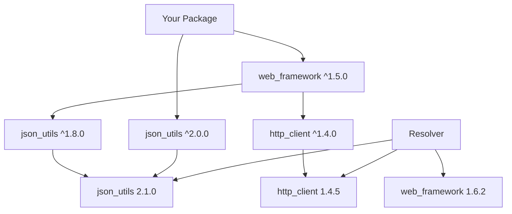

# Dependency Management Best Practices 🔗

Master the art of dependency management in CURSED! This guide covers everything from basic dependency usage to advanced strategies for maintaining healthy, secure, and performant projects.

## Understanding Dependencies 📚

### Types of Dependencies

CURSED packages can have three types of dependencies:

```toml
[dependencies]
# Runtime dependencies - required for your package to work
json_utils = "2.1.0"
http_client = "1.5.0"

[dev-dependencies] 
# Development dependencies - only needed during development/testing
test_framework = "2.0.0"
mock_server = "1.3.0"
benchmark_tools = "0.8.0"

[build-dependencies]
# Build dependencies - needed during the build process
code_generator = "1.2.0"
protobuf_compiler = "3.0.0"
```

### Dependency Resolution

The package manager uses a sophisticated resolver to find compatible versions:



## Version Constraints Strategy 📏

### Choosing the Right Constraint

| Use Case | Constraint | Example | Rationale |
|----------|------------|---------|-----------|
| **Stable APIs** | `^major.minor.patch` | `^2.1.0` | Allow compatible updates |
| **Bleeding edge** | `>=major.minor.patch` | `>=2.1.0` | Get latest features |
| **Conservative** | `~major.minor.patch` | `~2.1.0` | Only patch updates |
| **Exact match** | `=major.minor.patch` | `=2.1.0` | No version changes |
| **Security updates** | `>=major.minor.patch, <next_major` | `>=2.1.5, <3.0.0` | Allow security fixes |

### Examples by Stability Level

```toml
[dependencies]
# Mature, stable libraries - allow minor updates
serde = "^1.0.0"
tokio = "^1.0.0"

# Rapidly evolving libraries - be more conservative
experimental_ai = "~0.3.0"
new_web_framework = "=0.2.1"

# Security-critical libraries - stay current
crypto_utils = ">=2.1.5, <3.0.0"
tls_provider = "^2.0.0"

# Internal/company libraries - exact versions
internal_core = "=1.2.3"
company_utils = "=2.0.1"
```

## Dependency Hygiene 🧹

### Minimize Dependencies

Every dependency adds:
- **Build time**: More code to compile
- **Binary size**: Larger executables
- **Security surface**: More potential vulnerabilities
- **Maintenance burden**: Dependencies can break or become unmaintained

```toml
# ❌ Bad: Kitchen sink approach
[dependencies]
utils = "1.0"           # Generic utility library
helper = "2.0"          # Another generic library
convenience = "1.5"     # Convenience functions
everything = "3.0"      # "Does everything" library

# ✅ Good: Specific, focused dependencies
[dependencies]
json_parser = "2.1.0"   # Specific JSON functionality
http_client = "1.5.0"   # Specific HTTP functionality
```

### Audit Your Dependencies

Regular dependency auditing is crucial:

```bash
# Check for security vulnerabilities
cursed-pkg audit

# See dependency tree
cursed-pkg tree

# List all dependencies
cursed-pkg list

# Check for outdated packages
cursed-pkg outdated
```

### Use Features to Reduce Bloat

Enable only the features you need:

```toml
[dependencies]
# ❌ Bad: Include everything
web_framework = "3.0"

# ✅ Good: Only include what you need
web_framework = { version = "3.0", features = ["json", "middleware"], default-features = false }
```

## Lock Files and Reproducible Builds 🔒

### Understanding CursedPackage.lock

The lock file ensures everyone gets the same dependency versions:

```toml
# CursedPackage.lock - Generated automatically
[[package]]
name = "json_utils"
version = "2.1.0"
checksum = "abc123def456789..."
dependencies = [
    "string_utils 1.0.0"
]

[[package]]
name = "string_utils"
version = "1.0.0"
checksum = "def456ghi789012..."
dependencies = []
```

### Lock File Best Practices

```bash
# ✅ Always commit lock files to version control
git add CursedPackage.lock
git commit -m "Update dependencies"

# ✅ Use --locked in CI/CD for reproducible builds
cursed-pkg build --locked

# ✅ Update lock file when adding dependencies
cursed-pkg add new_dependency
# CursedPackage.lock is automatically updated

# ✅ Periodic lock file updates
cursed-pkg update
git add CursedPackage.lock
git commit -m "Update dependency lock file"
```

### CI/CD Integration

```yaml
# .github/workflows/test.yml
name: Test
on: [push, pull_request]

jobs:
  test:
    runs-on: ubuntu-latest
    steps:
      - uses: actions/checkout@v3
      
      - name: Install CURSED
        uses: cursed-lang/setup-cursed@v1
        
      - name: Check lock file is up to date
        run: |
          cursed-pkg lock --dry-run
          git diff --exit-code CursedPackage.lock
          
      - name: Build with locked dependencies
        run: cursed-pkg build --locked
        
      - name: Test with locked dependencies
        run: cursed-pkg test --locked
```

## Managing Breaking Changes 💥

### Semantic Versioning in Practice

Understanding what constitutes a breaking change:

| Change Type | Version Bump | Example |
|-------------|--------------|---------|
| **Bug fix** | Patch (1.0.1) | Fix calculation error |
| **New feature** | Minor (1.1.0) | Add new function |
| **Breaking change** | Major (2.0.0) | Change function signature |

### Handling Breaking Updates

```toml
# Before: Your app uses web_framework 1.x
[dependencies]
web_framework = "^1.5.0"  # Resolves to 1.6.2

# web_framework releases 2.0.0 with breaking changes
# Your constraint prevents automatic update - good!

# When ready to upgrade:
[dependencies]
web_framework = "^2.0.0"  # Now allows 2.x versions
```

### Migration Strategy

1. **Read the changelog** before upgrading major versions
2. **Test in a branch** before merging updates
3. **Use deprecation warnings** to prepare for changes
4. **Pin versions** temporarily if upgrade isn't feasible

```bash
# Create migration branch
git checkout -b upgrade-web-framework

# Update to new major version
cursed-pkg add web_framework@^2.0.0

# Test thoroughly
cursed-pkg test --all-features

# Fix any breaking changes
# ... make necessary code changes ...

# Merge when ready
git checkout main
git merge upgrade-web-framework
```

## Security Best Practices 🔒

### Regular Security Audits

```bash
# Daily: Quick security check
cursed-pkg audit

# Weekly: Detailed audit with fix recommendations
cursed-pkg audit --fix --verbose

# Before release: Comprehensive security review
cursed-pkg audit --format json > security-report.json
```

### Dependency Trust Management

```bash
# Trust established publishers
cursed-pkg trust add cursed-team@cursed-lang.org
cursed-pkg trust add company-dev@mycompany.com

# Audit new dependencies before adding
cursed-pkg show unknown_package
cursed-pkg info unknown_package --json

# Use private registries for sensitive code
cursed-pkg add internal_crypto --registry https://internal.company.com
```

### Supply Chain Security

```toml
# Pin critical dependencies to exact versions
[dependencies]
crypto_core = "=2.1.3"      # Security-critical
auth_provider = "=1.5.2"    # Authentication

# Allow updates for less critical dependencies
ui_components = "^1.2.0"    # UI library
logging_utils = "^0.8.0"    # Logging utilities
```

## Performance Optimization 🚀

### Build Performance

```toml
# Use features to reduce compilation time
[dependencies]
large_framework = { version = "3.0", features = ["core"], default-features = false }

# Prefer lightweight alternatives
json_parser = "2.1.0"      # Fast, lightweight
# Instead of: kitchen_sink = "5.0.0"  # Heavy, feature-rich
```

### Runtime Performance

```toml
# Choose dependencies based on performance characteristics
[dependencies]
fast_hasher = "1.0"         # Optimized for speed
small_encoder = "2.0"       # Optimized for size
memory_efficient = "1.5"    # Optimized for memory usage
```

### Profiling Dependencies

```bash
# Build with profiling information
cursed-pkg build --profile bench

# Run benchmarks to measure dependency impact
cursed-pkg bench

# Use timing tools to measure build performance
time cursed-pkg build --release
```

## Workspace Dependency Management 🏢

### Shared Dependencies

```toml
# CursedWorkspace.toml - Define shared dependencies
[workspace.dependencies]
serde = "1.0"
tokio = "1.0"
log = "0.4"

# Individual packages inherit these versions
# packages/web/CursedPackage.toml
[dependencies]
serde = { workspace = true }    # Uses workspace version
tokio = { workspace = true, features = ["full"] }  # Add features
```

### Version Alignment

```bash
# Update all workspace packages together
cursed-pkg update --workspace

# Check for version inconsistencies
cursed-pkg tree --workspace --duplicates

# Build entire workspace
cursed-pkg build --workspace
```

### Dependency Conflicts in Workspaces

```toml
# Problem: Different packages need different versions
# packages/old-service/CursedPackage.toml
[dependencies]
legacy_lib = "1.0"

# packages/new-service/CursedPackage.toml  
[dependencies]
legacy_lib = "2.0"  # Breaking change

# Solution: Use rename to allow both versions
# packages/old-service/CursedPackage.toml
[dependencies]
legacy_lib_v1 = { package = "legacy_lib", version = "1.0" }

# packages/new-service/CursedPackage.toml
[dependencies]
legacy_lib = "2.0"
```

## Advanced Dependency Patterns 🎯

### Optional Dependencies and Features

```toml
[dependencies]
# Core dependencies - always included
core_utils = "1.0"

# Optional dependencies - only with features
async_runtime = { version = "1.0", optional = true }
database_driver = { version = "2.0", optional = true }
cache_provider = { version = "1.5", optional = true }

[features]
default = ["basic"]

# Feature definitions
basic = []
async = ["async_runtime"]
database = ["database_driver", "sqlx"]
caching = ["cache_provider", "redis"]

# Feature combinations
full = ["async", "database", "caching"]
web = ["async", "database"]
```

Usage in code:

```cursed
vibe my_package

#[cfg(feature = "async")]
import "async_runtime"

#[cfg(feature = "database")]
import "database_driver"

export slay process_data(data tea) Result<tea, tea> {
    #[cfg(feature = "async")]
    {
        cap async_runtime.process_async(data)
    }
    
    #[cfg(not(feature = "async"))]
    {
        cap process_sync(data)
    }
}
```

### Git Dependencies

```toml
[dependencies]
# Track specific branch
experimental = { git = "https://github.com/org/experimental", branch = "dev" }

# Track specific tag
stable_release = { git = "https://github.com/org/stable", tag = "v2.1.0" }

# Track specific commit
hotfix = { git = "https://github.com/org/project", rev = "abc123def456" }

# Private repositories (requires authentication)
private_lib = { git = "https://github.com/company/private", branch = "main" }
```

### Path Dependencies

```toml
[dependencies]
# Local development
local_lib = { path = "../my-local-lib" }

# Relative to workspace root
workspace_lib = { path = "libs/common" }

# For development/testing only
[dev-dependencies]
test_utils = { path = "test-support" }
```

### Platform-Specific Dependencies

```toml
# Unix-only dependencies
[target.'cfg(unix)'.dependencies]
unix_sockets = "1.0"
epoll = "2.0"

# Windows-only dependencies
[target.'cfg(windows)'.dependencies]
winapi = "0.3"
windows_service = "1.0"

# Architecture-specific
[target.'cfg(target_arch = "x86_64")'.dependencies]
simd_optimized = "1.0"

# Conditional features
[target.'cfg(feature = "server")'.dependencies]
server_framework = "2.0"
```

## Troubleshooting Common Issues 🔧

### Version Conflicts

```bash
# Problem: Cannot resolve dependency versions
cursed-pkg build
# Error: Cannot resolve dependency conflict between json_utils ^1.0 and ^2.0

# Solution 1: Check dependency tree
cursed-pkg tree --duplicates

# Solution 2: Update conflicting dependencies
cursed-pkg update json_utils

# Solution 3: Use specific version constraints
# Edit CursedPackage.toml to resolve conflicts manually
```

### Build Failures

```bash
# Problem: Dependencies fail to build
cursed-pkg build
# Error: Failed to compile crypto_utils v2.1.0

# Solution 1: Check dependency compatibility
cursed-pkg check

# Solution 2: Use different version
cursed-pkg add crypto_utils@2.0.0 --force

# Solution 3: Check target compatibility
cursed-pkg build --target x86_64-unknown-linux-gnu
```

### Network Issues

```bash
# Problem: Cannot download dependencies
cursed-pkg build
# Error: Network timeout downloading json_utils

# Solution 1: Check network configuration
cursed-pkg config get registry.default

# Solution 2: Use offline mode with cache
cursed-pkg build --offline

# Solution 3: Configure proxy
export HTTPS_PROXY=http://proxy.company.com:8080
cursed-pkg build
```

### Authentication Problems

```bash
# Problem: Cannot access private registry
cursed-pkg build
# Error: Authentication failed for https://registry.company.com

# Solution 1: Login again
cursed-pkg login https://registry.company.com

# Solution 2: Check token validity
cursed-pkg whoami --registry https://registry.company.com

# Solution 3: Use environment variable
export CURSED_TOKEN=your_token_here
cursed-pkg build
```

## Monitoring and Maintenance 📊

### Dependency Health Checks

Create a script to regularly check dependency health:

```bash
#!/bin/bash
# check-deps.sh - Regular dependency health check

echo "🔍 Checking dependency health..."

# Security audit
echo "Security audit:"
cursed-pkg audit || echo "⚠️  Security issues found"

# Check for outdated dependencies
echo "Outdated dependencies:"
cursed-pkg outdated || echo "✅ All dependencies up to date"

# Verify lock file
echo "Lock file verification:"
cursed-pkg verify || echo "⚠️  Lock file issues"

# Dependency tree analysis
echo "Duplicate dependencies:"
cursed-pkg tree --duplicates | wc -l

echo "✅ Dependency health check complete"
```

### Automated Dependency Updates

Use GitHub Actions for automated updates:

```yaml
# .github/workflows/dependency-update.yml
name: Update Dependencies
on:
  schedule:
    - cron: '0 0 * * 1'  # Weekly on Monday
  workflow_dispatch:

jobs:
  update:
    runs-on: ubuntu-latest
    steps:
      - uses: actions/checkout@v3
      
      - name: Update dependencies
        run: |
          cursed-pkg update
          cursed-pkg audit --fix
          
      - name: Create pull request
        uses: peter-evans/create-pull-request@v4
        with:
          title: 'chore: update dependencies'
          body: 'Automated dependency update'
          branch: update-dependencies
```

### Dependency Metrics

Track important metrics:

```bash
# Number of dependencies
echo "Dependencies: $(cursed-pkg list | wc -l)"

# Dependency tree depth
echo "Max depth: $(cursed-pkg tree --depth 10 | grep -o '│' | wc -l)"

# Security vulnerabilities
echo "Vulnerabilities: $(cursed-pkg audit --format json | jq '.vulnerabilities | length')"

# Outdated packages
echo "Outdated: $(cursed-pkg outdated --format json | jq '.outdated | length')"
```

## Best Practices Summary ✅

### Do's ✅

1. **Pin versions** for production deployments
2. **Use semantic versioning** constraints appropriately
3. **Audit dependencies** regularly for security
4. **Minimize dependencies** to reduce attack surface
5. **Use features** to include only needed functionality
6. **Commit lock files** to ensure reproducible builds
7. **Test dependency updates** before merging
8. **Document dependency choices** in your README
9. **Use workspace dependencies** for consistency
10. **Monitor dependency health** with automated tools

### Don'ts ❌

1. **Don't ignore security warnings** from audits
2. **Don't use wildcards** (`*`) in production
3. **Don't mix dependency sources** unnecessarily
4. **Don't skip testing** after dependency updates
5. **Don't use unmaintained packages** in critical code
6. **Don't ignore license compatibility** issues
7. **Don't update major versions** without planning
8. **Don't commit without updating** lock files
9. **Don't use exact versions** for everything
10. **Don't add dependencies** without justification

### Quick Reference Checklist 📋

Before adding a new dependency:
- [ ] Is this dependency really needed?
- [ ] Are there lighter alternatives?
- [ ] Is the package actively maintained?
- [ ] Does it have a compatible license?
- [ ] Are there any security issues?
- [ ] What's the impact on build time/binary size?
- [ ] Does it align with project architecture?

Before updating dependencies:
- [ ] Read the changelog for breaking changes
- [ ] Test in a separate branch first
- [ ] Run full test suite after update
- [ ] Check for new security vulnerabilities
- [ ] Verify license compatibility
- [ ] Update documentation if needed

Master these practices and your CURSED projects will have rock-solid dependency management! 🔗✨
