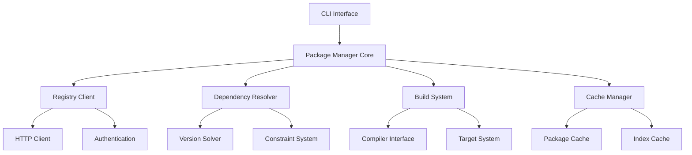

# Package Manager API Documentation 🔧

This document provides comprehensive API documentation for the CURSED package manager's internal modules and extension points. Use this guide to understand the package manager's architecture and integrate with or extend its functionality.

## Core Architecture 🏗️

### Package Manager Structure



### Module Overview

| Module | Purpose | Key Components |
|--------|---------|----------------|
| `core::package_manager` | Main coordinator | `PackageManager`, `Config` |
| `registry::client` | Registry communication | `RegistryClient`, `HttpClient` |
| `resolver::dependency` | Dependency resolution | `DependencyResolver`, `VersionSolver` |
| `build::system` | Build coordination | `BuildSystem`, `Target` |
| `cache::manager` | Caching layer | `CacheManager`, `PackageCache` |
| `auth::provider` | Authentication | `AuthProvider`, `TokenManager` |
| `manifest::parser` | Manifest handling | `ManifestParser`, `PackageManifest` |

## Core APIs 📋

### PackageManager

The main entry point for all package manager operations.

```rust
pub struct PackageManager {
    config: Config,
    registry_client: RegistryClient,
    dependency_resolver: DependencyResolver,
    build_system: BuildSystem,
    cache_manager: CacheManager,
}

impl PackageManager {
    /// Create a new package manager instance
    pub fn new(config: Config) -> Result<Self, PackageManagerError> {
        // Implementation details...
    }
    
    /// Initialize a new package project
    pub async fn init_package(
        &self,
        path: &Path,
        options: InitOptions,
    ) -> Result<PackageManifest, PackageManagerError> {
        // Implementation details...
    }
    
    /// Add a dependency to the current package
    pub async fn add_dependency(
        &self,
        spec: &DependencySpec,
        options: AddOptions,
    ) -> Result<(), PackageManagerError> {
        // Implementation details...
    }
    
    /// Build the current package
    pub async fn build_package(
        &self,
        manifest: &PackageManifest,
        options: BuildOptions,
    ) -> Result<BuildResult, PackageManagerError> {
        // Implementation details...
    }
    
    /// Publish package to registry
    pub async fn publish_package(
        &self,
        manifest: &PackageManifest,
        options: PublishOptions,
    ) -> Result<PublishResult, PackageManagerError> {
        // Implementation details...
    }
}
```

### Configuration System

```rust
#[derive(Debug, Clone, Serialize, Deserialize)]
pub struct Config {
    pub registry: RegistryConfig,
    pub build: BuildConfig,
    pub cache: CacheConfig,
    pub auth: AuthConfig,
}

#[derive(Debug, Clone, Serialize, Deserialize)]
pub struct RegistryConfig {
    pub default_registry: Url,
    pub registries: HashMap<String, RegistryInfo>,
    pub timeout: Duration,
    pub max_retries: u32,
}

#[derive(Debug, Clone, Serialize, Deserialize)]
pub struct BuildConfig {
    pub target_dir: PathBuf,
    pub parallel_jobs: Option<usize>,
    pub default_profile: String,
    pub profiles: HashMap<String, BuildProfile>,
}

impl Config {
    /// Load configuration from file and environment
    pub fn load() -> Result<Self, ConfigError> {
        // Implementation details...
    }
    
    /// Save configuration to file
    pub fn save(&self, path: &Path) -> Result<(), ConfigError> {
        // Implementation details...
    }
    
    /// Merge with another configuration
    pub fn merge(&mut self, other: Config) {
        // Implementation details...
    }
}
```

## Registry Client API 🌐

### RegistryClient

Handles communication with package registries.

```rust
pub struct RegistryClient {
    http_client: HttpClient,
    auth_provider: AuthProvider,
    config: RegistryConfig,
}

impl RegistryClient {
    /// Search for packages in registry
    pub async fn search_packages(
        &self,
        query: &str,
        options: SearchOptions,
    ) -> Result<SearchResults, RegistryError> {
        // Implementation details...
    }
    
    /// Get package metadata
    pub async fn get_package_metadata(
        &self,
        name: &PackageName,
        version: Option<&Version>,
    ) -> Result<PackageMetadata, RegistryError> {
        // Implementation details...
    }
    
    /// Download package archive
    pub async fn download_package(
        &self,
        name: &PackageName,
        version: &Version,
    ) -> Result<PackageArchive, RegistryError> {
        // Implementation details...
    }
    
    /// Publish package to registry
    pub async fn publish_package(
        &self,
        package: &PackageArchive,
        metadata: &PackageMetadata,
    ) -> Result<PublishResponse, RegistryError> {
        // Implementation details...
    }
    
    /// Authenticate with registry
    pub async fn authenticate(
        &self,
        credentials: &Credentials,
    ) -> Result<AuthToken, RegistryError> {
        // Implementation details...
    }
}

#[derive(Debug, Clone)]
pub struct SearchOptions {
    pub limit: Option<usize>,
    pub offset: Option<usize>,
    pub registry: Option<String>,
    pub categories: Vec<String>,
}

#[derive(Debug, Clone, Serialize, Deserialize)]
pub struct SearchResults {
    pub packages: Vec<PackageSummary>,
    pub total: usize,
    pub next_page: Option<String>,
}

#[derive(Debug, Clone, Serialize, Deserialize)]
pub struct PackageSummary {
    pub name: PackageName,
    pub latest_version: Version,
    pub description: String,
    pub downloads: u64,
    pub updated_at: DateTime<Utc>,
}
```

### Authentication

```rust
pub trait AuthProvider {
    async fn get_token(&self, registry: &str) -> Result<Option<AuthToken>, AuthError>;
    async fn set_token(&self, registry: &str, token: AuthToken) -> Result<(), AuthError>;
    async fn remove_token(&self, registry: &str) -> Result<(), AuthError>;
}

#[derive(Debug, Clone)]
pub struct AuthToken {
    pub token: String,
    pub expires_at: Option<DateTime<Utc>>,
}

pub struct TokenManager {
    storage: Box<dyn TokenStorage>,
}

impl AuthProvider for TokenManager {
    // Implementation details...
}
```

## Dependency Resolution API 🔗

### DependencyResolver

Resolves dependency constraints and creates build plans.

```rust
pub struct DependencyResolver {
    version_solver: VersionSolver,
    registry_client: RegistryClient,
    cache_manager: CacheManager,
}

impl DependencyResolver {
    /// Resolve dependencies for a package
    pub async fn resolve_dependencies(
        &self,
        manifest: &PackageManifest,
        options: ResolveOptions,
    ) -> Result<DependencyGraph, ResolverError> {
        // Implementation details...
    }
    
    /// Update specific dependencies
    pub async fn update_dependencies(
        &self,
        current_graph: &DependencyGraph,
        updates: &[DependencyUpdate],
    ) -> Result<DependencyGraph, ResolverError> {
        // Implementation details...
    }
    
    /// Validate dependency constraints
    pub fn validate_constraints(
        &self,
        constraints: &[DependencyConstraint],
    ) -> Result<(), ResolverError> {
        // Implementation details...
    }
}

#[derive(Debug, Clone)]
pub struct ResolveOptions {
    pub update_strategy: UpdateStrategy,
    pub allow_prerelease: bool,
    pub offline: bool,
    pub features: Vec<String>,
}

#[derive(Debug, Clone)]
pub enum UpdateStrategy {
    Conservative,  // Only patch updates
    Compatible,    // Minor and patch updates
    Latest,        // All updates including major
}

#[derive(Debug, Clone)]
pub struct DependencyGraph {
    pub root: PackageId,
    pub nodes: HashMap<PackageId, DependencyNode>,
    pub edges: Vec<DependencyEdge>,
}

#[derive(Debug, Clone)]
pub struct DependencyNode {
    pub package_id: PackageId,
    pub features: Vec<String>,
    pub source: DependencySource,
}

#[derive(Debug, Clone)]
pub enum DependencySource {
    Registry { name: String, version: Version },
    Git { url: Url, rev: String },
    Path { path: PathBuf },
}
```

### Version Solving

```rust
pub struct VersionSolver {
    strategy: SolvingStrategy,
}

impl VersionSolver {
    /// Solve version constraints
    pub fn solve(
        &self,
        constraints: &[VersionConstraint],
        available: &[AvailableVersion],
    ) -> Result<Solution, SolverError> {
        // Implementation details...
    }
    
    /// Check if constraints are satisfiable
    pub fn is_satisfiable(
        &self,
        constraints: &[VersionConstraint],
    ) -> bool {
        // Implementation details...
    }
}

#[derive(Debug, Clone)]
pub struct VersionConstraint {
    pub package: PackageName,
    pub requirement: VersionReq,
    pub source: ConstraintSource,
}

#[derive(Debug, Clone)]
pub enum ConstraintSource {
    Direct,      // Direct dependency
    Transitive,  // Transitive dependency
    Feature,     // Feature requirement
    Platform,    // Platform-specific
}

#[derive(Debug, Clone)]
pub struct Solution {
    pub selections: HashMap<PackageName, Version>,
    pub reasoning: Vec<SelectionReason>,
}
```

## Build System API 🔨

### BuildSystem

Coordinates package compilation and linking.

```rust
pub struct BuildSystem {
    compiler: CompilerInterface,
    target_manager: TargetManager,
    config: BuildConfig,
}

impl BuildSystem {
    /// Build a package with its dependencies
    pub async fn build_package(
        &self,
        manifest: &PackageManifest,
        dependency_graph: &DependencyGraph,
        options: BuildOptions,
    ) -> Result<BuildResult, BuildError> {
        // Implementation details...
    }
    
    /// Build specific targets
    pub async fn build_targets(
        &self,
        targets: &[BuildTarget],
        options: BuildOptions,
    ) -> Result<Vec<BuildArtifact>, BuildError> {
        // Implementation details...
    }
    
    /// Clean build artifacts
    pub fn clean(&self, options: CleanOptions) -> Result<(), BuildError> {
        // Implementation details...
    }
}

#[derive(Debug, Clone)]
pub struct BuildOptions {
    pub profile: String,
    pub target: Option<String>,
    pub features: Vec<String>,
    pub parallel_jobs: Option<usize>,
    pub offline: bool,
}

#[derive(Debug, Clone)]
pub struct BuildResult {
    pub artifacts: Vec<BuildArtifact>,
    pub duration: Duration,
    pub warnings: Vec<BuildWarning>,
}

#[derive(Debug, Clone)]
pub struct BuildArtifact {
    pub kind: ArtifactKind,
    pub path: PathBuf,
    pub target: String,
}

#[derive(Debug, Clone)]
pub enum ArtifactKind {
    Library,
    Binary { name: String },
    Example { name: String },
    Test { name: String },
}
```

### Compiler Interface

```rust
pub trait CompilerInterface {
    async fn compile_package(
        &self,
        manifest: &PackageManifest,
        options: CompileOptions,
    ) -> Result<CompileResult, CompileError>;
    
    fn supported_targets(&self) -> Vec<String>;
    
    fn version(&self) -> CompilerVersion;
}

#[derive(Debug, Clone)]
pub struct CompileOptions {
    pub output_dir: PathBuf,
    pub optimization_level: OptimizationLevel,
    pub debug_info: bool,
    pub target: String,
    pub features: Vec<String>,
}

#[derive(Debug, Clone)]
pub enum OptimizationLevel {
    None,
    Fast,
    Size,
    Max,
}

pub struct CursedCompiler {
    binary_path: PathBuf,
    version: CompilerVersion,
}

impl CompilerInterface for CursedCompiler {
    // Implementation details...
}
```

## Cache Management API 📦

### CacheManager

Manages package and metadata caching for performance.

```rust
pub struct CacheManager {
    package_cache: PackageCache,
    index_cache: IndexCache,
    build_cache: BuildCache,
    config: CacheConfig,
}

impl CacheManager {
    /// Get cached package
    pub async fn get_package(
        &self,
        name: &PackageName,
        version: &Version,
    ) -> Result<Option<CachedPackage>, CacheError> {
        // Implementation details...
    }
    
    /// Cache a package
    pub async fn cache_package(
        &self,
        package: PackageArchive,
    ) -> Result<CachedPackage, CacheError> {
        // Implementation details...
    }
    
    /// Clear cache
    pub fn clear_cache(&self, options: ClearOptions) -> Result<(), CacheError> {
        // Implementation details...
    }
    
    /// Get cache statistics
    pub fn get_stats(&self) -> CacheStats {
        // Implementation details...
    }
}

#[derive(Debug, Clone)]
pub struct CachedPackage {
    pub metadata: PackageMetadata,
    pub archive_path: PathBuf,
    pub extracted_path: Option<PathBuf>,
    pub cached_at: DateTime<Utc>,
}

#[derive(Debug, Clone)]
pub struct CacheStats {
    pub total_size: u64,
    pub package_count: usize,
    pub hit_rate: f64,
    pub last_cleanup: DateTime<Utc>,
}
```

### Package Cache

```rust
pub trait PackageCache {
    async fn get(&self, key: &CacheKey) -> Result<Option<Vec<u8>>, CacheError>;
    async fn put(&self, key: &CacheKey, data: Vec<u8>) -> Result<(), CacheError>;
    async fn remove(&self, key: &CacheKey) -> Result<(), CacheError>;
    async fn clear(&self) -> Result<(), CacheError>;
}

#[derive(Debug, Clone, Hash, Eq, PartialEq)]
pub struct CacheKey {
    pub package: PackageName,
    pub version: Version,
    pub kind: CacheKind,
}

#[derive(Debug, Clone, Hash, Eq, PartialEq)]
pub enum CacheKind {
    Archive,
    Metadata,
    BuildArtifact { target: String, profile: String },
}

pub struct FilesystemCache {
    cache_dir: PathBuf,
    max_size: Option<u64>,
}

impl PackageCache for FilesystemCache {
    // Implementation details...
}
```

## Manifest Parsing API 📄

### ManifestParser

Parses and validates CursedPackage.toml files.

```rust
pub struct ManifestParser {
    schema_validator: SchemaValidator,
}

impl ManifestParser {
    /// Parse manifest from file
    pub fn parse_file(&self, path: &Path) -> Result<PackageManifest, ManifestError> {
        // Implementation details...
    }
    
    /// Parse manifest from string
    pub fn parse_str(&self, content: &str) -> Result<PackageManifest, ManifestError> {
        // Implementation details...
    }
    
    /// Validate manifest
    pub fn validate(&self, manifest: &PackageManifest) -> Result<(), ValidationError> {
        // Implementation details...
    }
    
    /// Serialize manifest to string
    pub fn serialize(&self, manifest: &PackageManifest) -> Result<String, ManifestError> {
        // Implementation details...
    }
}

#[derive(Debug, Clone, Serialize, Deserialize)]
pub struct PackageManifest {
    pub package: PackageInfo,
    pub dependencies: HashMap<String, DependencySpec>,
    pub dev_dependencies: HashMap<String, DependencySpec>,
    pub build_dependencies: HashMap<String, DependencySpec>,
    pub features: HashMap<String, Vec<String>>,
    pub targets: Vec<TargetSpec>,
    pub workspace: Option<WorkspaceSpec>,
}

#[derive(Debug, Clone, Serialize, Deserialize)]
pub struct PackageInfo {
    pub name: PackageName,
    pub version: Version,
    pub authors: Vec<String>,
    pub description: Option<String>,
    pub license: Option<String>,
    pub repository: Option<Url>,
    pub documentation: Option<Url>,
    pub homepage: Option<Url>,
    pub keywords: Vec<String>,
    pub categories: Vec<String>,
}

#[derive(Debug, Clone, Serialize, Deserialize)]
pub enum DependencySpec {
    Simple(VersionReq),
    Detailed {
        version: Option<VersionReq>,
        registry: Option<String>,
        git: Option<Url>,
        branch: Option<String>,
        tag: Option<String>,
        rev: Option<String>,
        path: Option<PathBuf>,
        features: Vec<String>,
        optional: bool,
        default_features: bool,
    },
}
```

## Error Handling 🚨

### Error Types

```rust
#[derive(Debug, thiserror::Error)]
pub enum PackageManagerError {
    #[error("Registry error: {0}")]
    Registry(#[from] RegistryError),
    
    #[error("Dependency resolution error: {0}")]
    Resolver(#[from] ResolverError),
    
    #[error("Build error: {0}")]
    Build(#[from] BuildError),
    
    #[error("Cache error: {0}")]
    Cache(#[from] CacheError),
    
    #[error("Manifest error: {0}")]
    Manifest(#[from] ManifestError),
    
    #[error("IO error: {0}")]
    Io(#[from] std::io::Error),
    
    #[error("Configuration error: {0}")]
    Config(#[from] ConfigError),
}

#[derive(Debug, thiserror::Error)]
pub enum RegistryError {
    #[error("Package not found: {package}")]
    PackageNotFound { package: PackageName },
    
    #[error("Authentication failed")]
    AuthenticationFailed,
    
    #[error("Network error: {0}")]
    Network(#[from] reqwest::Error),
    
    #[error("Invalid response: {message}")]
    InvalidResponse { message: String },
}

#[derive(Debug, thiserror::Error)]
pub enum ResolverError {
    #[error("Version conflict: {package} requires {requirements:?}")]
    VersionConflict {
        package: PackageName,
        requirements: Vec<VersionReq>,
    },
    
    #[error("Circular dependency: {cycle:?}")]
    CircularDependency { cycle: Vec<PackageName> },
    
    #[error("Missing dependency: {package}")]
    MissingDependency { package: PackageName },
}
```

## Extension Points 🔌

### Plugin System

```rust
pub trait PackageManagerPlugin {
    fn name(&self) -> &str;
    fn version(&self) -> &str;
    
    fn on_package_init(&self, manifest: &mut PackageManifest) -> Result<(), PluginError>;
    fn on_dependency_added(&self, spec: &DependencySpec) -> Result<(), PluginError>;
    fn on_build_start(&self, options: &BuildOptions) -> Result<(), PluginError>;
    fn on_build_complete(&self, result: &BuildResult) -> Result<(), PluginError>;
    fn on_publish(&self, manifest: &PackageManifest) -> Result<(), PluginError>;
}

pub struct PluginManager {
    plugins: Vec<Box<dyn PackageManagerPlugin>>,
}

impl PluginManager {
    pub fn register_plugin(&mut self, plugin: Box<dyn PackageManagerPlugin>) {
        // Implementation details...
    }
    
    pub fn trigger_init(&self, manifest: &mut PackageManifest) -> Result<(), PluginError> {
        // Implementation details...
    }
    
    // Other trigger methods...
}
```

### Custom Registry Providers

```rust
pub trait RegistryProvider {
    async fn search(&self, query: &str) -> Result<SearchResults, RegistryError>;
    async fn get_metadata(&self, name: &PackageName) -> Result<PackageMetadata, RegistryError>;
    async fn download(&self, name: &PackageName, version: &Version) -> Result<Vec<u8>, RegistryError>;
    async fn publish(&self, package: &PackageArchive) -> Result<(), RegistryError>;
}

pub struct CustomRegistryProvider {
    config: CustomRegistryConfig,
    client: HttpClient,
}

impl RegistryProvider for CustomRegistryProvider {
    // Implementation details...
}
```

## Testing Utilities 🧪

### Mock Implementations

```rust
pub mod testing {
    use super::*;
    
    pub struct MockRegistryClient {
        packages: HashMap<PackageName, Vec<PackageMetadata>>,
    }
    
    impl MockRegistryClient {
        pub fn new() -> Self {
            Self {
                packages: HashMap::new(),
            }
        }
        
        pub fn add_package(&mut self, metadata: PackageMetadata) {
            // Implementation details...
        }
    }
    
    #[async_trait]
    impl RegistryClient for MockRegistryClient {
        // Mock implementation...
    }
    
    pub struct MockBuildSystem {
        build_results: HashMap<PackageName, BuildResult>,
    }
    
    impl BuildSystem for MockBuildSystem {
        // Mock implementation...
    }
}
```

### Test Helpers

```rust
pub mod test_helpers {
    use super::*;
    
    pub fn create_test_manifest(name: &str, version: &str) -> PackageManifest {
        // Implementation details...
    }
    
    pub async fn create_test_package_manager() -> PackageManager {
        // Implementation details...
    }
    
    pub fn assert_dependency_graph_valid(graph: &DependencyGraph) {
        // Implementation details...
    }
}
```

## Usage Examples 💡

### Basic Package Manager Usage

```rust
use cursed_pkg::{PackageManager, Config, InitOptions};

#[tokio::main]
async fn main() -> Result<(), Box<dyn std::error::Error>> {
    // Load configuration
    let config = Config::load()?;
    
    // Create package manager
    let package_manager = PackageManager::new(config)?;
    
    // Initialize new package
    let init_options = InitOptions {
        name: "my-awesome-package".to_string(),
        template: Some("library".to_string()),
        edition: "2024".to_string(),
    };
    
    let manifest = package_manager
        .init_package(Path::new("./my-package"), init_options)
        .await?;
    
    println!("Created package: {}", manifest.package.name);
    
    Ok(())
}
```

### Custom Registry Integration

```rust
use cursed_pkg::{RegistryProvider, RegistryError, PackageMetadata};

struct MyCustomRegistry {
    base_url: String,
    client: reqwest::Client,
}

#[async_trait]
impl RegistryProvider for MyCustomRegistry {
    async fn search(&self, query: &str) -> Result<SearchResults, RegistryError> {
        let url = format!("{}/search?q={}", self.base_url, query);
        let response = self.client.get(&url).send().await?;
        let results: SearchResults = response.json().await?;
        Ok(results)
    }
    
    async fn get_metadata(&self, name: &PackageName) -> Result<PackageMetadata, RegistryError> {
        let url = format!("{}/packages/{}", self.base_url, name);
        let response = self.client.get(&url).send().await?;
        let metadata: PackageMetadata = response.json().await?;
        Ok(metadata)
    }
    
    // Implement other methods...
}
```

### Plugin Development

```rust
use cursed_pkg::{PackageManagerPlugin, PackageManifest, PluginError};

struct LinterPlugin {
    config: LinterConfig,
}

impl PackageManagerPlugin for LinterPlugin {
    fn name(&self) -> &str {
        "cursed-linter"
    }
    
    fn version(&self) -> &str {
        "1.0.0"
    }
    
    fn on_build_start(&self, options: &BuildOptions) -> Result<(), PluginError> {
        println!("Running linter before build...");
        
        // Run linting logic
        self.run_linter()?;
        
        Ok(())
    }
    
    fn on_publish(&self, manifest: &PackageManifest) -> Result<(), PluginError> {
        println!("Validating package before publish...");
        
        // Run validation logic
        self.validate_package(manifest)?;
        
        Ok(())
    }
}

impl LinterPlugin {
    fn run_linter(&self) -> Result<(), PluginError> {
        // Implementation details...
        Ok(())
    }
    
    fn validate_package(&self, manifest: &PackageManifest) -> Result<(), PluginError> {
        // Implementation details...
        Ok(())
    }
}
```

## Configuration File Schema 📋

### Complete Configuration Schema

```toml
# ~/.cursed/config.toml

[registry]
default = "https://registry.cursed-lang.org"
timeout = 30
max_retries = 3

[registry.registries.default]
index = "https://registry.cursed-lang.org/index"
download = "https://registry.cursed-lang.org/download"

[registry.registries.company]
index = "https://registry.company.com/index"
download = "https://registry.company.com/download"
token = "secret-token"

[build]
target_dir = "target"
parallel_jobs = 4
default_profile = "dev"

[build.profiles.dev]
optimization = "none"
debug = true

[build.profiles.release]
optimization = "max"
debug = false
strip = true

[cache]
enabled = true
max_size = "10GB"
cleanup_interval = "7d"

[auth]
token_storage = "keychain"  # or "file"
```

That's the complete API documentation for the CURSED package manager! This provides all the interfaces and extension points you need to integrate with or extend the package manager's functionality! 🔧✨

For usage examples and higher-level guides, check out the [Package Manager User Guide](package_manager.md) and [CLI Reference](package_manager_cli.md).
