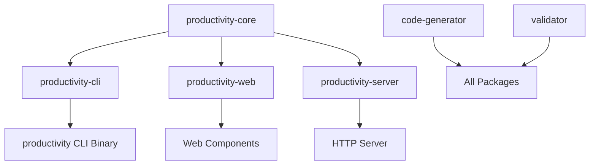

# CURSED Productivity Suite Workspace

A comprehensive example demonstrating workspace management with multiple interconnected packages, shared dependencies, and complex build configurations.

## Workspace Overview 🏗️

This workspace contains a complete productivity suite with:

### Packages (6 total)
- **`packages/core`**: Core functionality library
- **`packages/cli`**: Command-line interface
- **`packages/web`**: Web interface components
- **`packages/server`**: HTTP server implementation
- **`tools/generator`**: Code generation tools
- **`tools/validator`**: Validation utilities

### Architecture



## Features Demonstrated 🎯

### Workspace Management
- Multi-package workspace with 6 packages
- Shared dependencies across packages
- Cross-package dependencies
- Unified versioning and metadata
- Tool packages alongside main packages

### Dependency Strategies
- **Workspace dependencies**: Shared across all packages
- **Local dependencies**: Between workspace packages
- **Package-specific dependencies**: Unique to individual packages
- **Development dependencies**: Testing and development tools
- **Build dependencies**: Code generation and build tools

### Build Configurations
- **Workspace profiles**: Shared build configurations
- **Package-specific profiles**: Customized build settings
- **Feature flags**: Optional functionality across packages
- **Cross-compilation**: Multiple target support

## Quick Start 🚀

```bash
# Clone the workspace
git clone https://github.com/cursed-lang/examples
cd examples/package_manager/workspace_example

# Build entire workspace
cursed-pkg workspace build

# Run the CLI tool
cursed-pkg run -p productivity-cli

# Start the web server
cursed-pkg run -p productivity-server

# Generate code using tools
cursed-pkg run -p code-generator -- --output src/generated/

# Validate all packages
cursed-pkg run -p validator -- --workspace
```

## Workspace Commands 📋

### Building
```bash
# Build all packages
cursed-pkg workspace build

# Build specific package
cursed-pkg build -p productivity-core

# Build with specific profile
cursed-pkg workspace build --profile=release

# Build excluding certain packages
cursed-pkg workspace build --exclude=tools/*
```

### Testing
```bash
# Test entire workspace
cursed-pkg workspace test

# Test specific package
cursed-pkg test -p productivity-cli

# Test with all features
cursed-pkg workspace test --all-features

# Integration tests across packages
cursed-pkg test --workspace --test integration
```

### Dependency Management
```bash
# Update all workspace dependencies
cursed-pkg workspace update

# Add dependency to specific package
cursed-pkg add http_client -p productivity-server

# Add workspace-shared dependency
cursed-pkg add --workspace new_shared_lib

# View workspace dependency tree
cursed-pkg tree --workspace
```

## Package Details 📦

### Core Library (`packages/core/`)

The foundation library providing shared functionality:

**Key Features:**
- Configuration management
- Error handling utilities
- Data structures and algorithms
- Logging infrastructure
- Cryptographic utilities

**Dependencies:**
- Workspace shared: `json_utils`, `log_manager`, `error_handling`
- Package specific: `date_time`, `crypto_utils`

**Usage:**
```cursed
import "productivity_core/config"
import "productivity_core/errors"
import "productivity_core/data"
```

### CLI Application (`packages/cli/`)

Command-line interface for the productivity suite:

**Key Features:**
- Interactive command-line interface
- Configuration management commands
- File processing utilities
- Progress reporting
- Colored terminal output

**Dependencies:**
- Local: `productivity-core`
- Package specific: `arg_parser`, `terminal_ui`, `file_utils`

**Usage:**
```bash
# Basic commands
productivity --help
productivity config set key value
productivity process --input file.txt
```

### Web Components (`packages/web/`)

Web-based user interface components:

**Key Features:**
- Reusable UI components
- WebAssembly compilation
- Real-time updates
- Responsive design
- Accessibility support

### HTTP Server (`packages/server/`)

Backend server implementation:

**Key Features:**
- RESTful API endpoints
- WebSocket support
- Authentication middleware
- Database integration
- Real-time notifications

### Code Generator (`tools/generator/`)

Development tool for code generation:

**Key Features:**
- Template-based code generation
- Multi-language output support
- Configuration-driven generation
- Plugin architecture

### Validator (`tools/validator/`)

Quality assurance and validation tool:

**Key Features:**
- Code quality analysis
- Configuration validation
- Dependency security scanning
- Performance analysis

## Workspace Configuration 🔧

### Shared Dependencies

Defined in `CursedWorkspace.toml` and used by all packages:

```toml
[workspace.dependencies]
json_utils = "2.1.0"        # JSON parsing/serialization
log_manager = "1.5.0"       # Structured logging  
error_handling = "3.0.0"    # Error handling utilities
config_parser = "1.2.0"     # Configuration management
test_framework = "2.0.0"    # Testing infrastructure
```

### Package-Specific Usage

Each package references shared dependencies:

```toml
[dependencies]
json_utils.workspace = true
log_manager.workspace = true
# ... other workspace dependencies
```

### Build Profiles

Workspace-wide build configurations:

```toml
[workspace.profiles.dev]
optimization = "none"
debug = true

[workspace.profiles.release]  
optimization = "max"
debug = false
strip = true
```

## Development Workflow 🔄

### Daily Development

```bash
# Morning routine
cursed-pkg workspace check    # Quick health check
cursed-pkg workspace test     # Run all tests

# Development cycle
cursed-pkg build -p my-package         # Build specific package
cursed-pkg test -p my-package          # Test specific package
cursed-pkg run -p my-package -- args   # Run specific binary

# Evening routine
cursed-pkg workspace build --release   # Full release build
cursed-pkg workspace test --all-features  # Comprehensive testing
```

### Adding New Packages

```bash
# Create new package in workspace
mkdir -p packages/new-feature
cd packages/new-feature
cursed-pkg init --name productivity-new-feature

# Add to workspace
echo '    "packages/new-feature",' >> ../../CursedWorkspace.toml

# Build to verify
cursed-pkg workspace build
```

### Cross-Package Dependencies

```bash
# Add dependency between workspace packages
cd packages/cli
cursed-pkg add productivity-web --path "../web"

# Results in CursedPackage.toml:
# productivity-web = { path = "../web" }
```

## Advanced Workspace Features 🎛️

### Feature Flags Across Packages

Coordinate features across multiple packages:

```toml
# In CursedWorkspace.toml
[workspace.features]
default = ["basic"]
basic = []
advanced = ["crypto", "networking", "analytics"]
crypto = []
networking = []
analytics = []
```

Each package can reference workspace features:

```toml
# In individual CursedPackage.toml
[features]
default.workspace = true
crypto.workspace = true
```

### Conditional Dependencies

Different dependencies based on features:

```toml
[dependencies]
# Always included
productivity-core = { path = "../core" }

# Feature-conditional
crypto_provider = { version = "2.0", optional = true }
network_client = { version = "1.5", optional = true }

[features]
crypto = ["crypto_provider"]
networking = ["network_client"]
```

### Custom Build Scripts

Workspace-wide build automation:

```bash
#!/bin/bash
# scripts/workspace-build.sh

set -e

echo "🏗️  Building CURSED Productivity Suite..."

# Build core first (dependency of others)
echo "📦 Building core..."
cursed-pkg build -p productivity-core

# Build tools (used during build process)
echo "🔨 Building tools..."
cursed-pkg build -p code-generator
cursed-pkg build -p validator

# Generate code for other packages
echo "⚙️  Generating code..."
cursed-pkg run -p code-generator -- --workspace

# Build remaining packages
echo "🚀 Building applications..."
cursed-pkg build -p productivity-cli
cursed-pkg build -p productivity-web  
cursed-pkg build -p productivity-server

# Validate everything
echo "✅ Validating workspace..."
cursed-pkg run -p validator -- --workspace

echo "🎉 Workspace build complete!"
```

## Performance Optimization 🚀

### Parallel Building

```bash
# Build packages in parallel
cursed-pkg workspace build --jobs 4

# Build independent packages simultaneously
cursed-pkg build -p productivity-cli -p code-generator --parallel
```

### Caching Strategy

```bash
# Cache dependencies for faster rebuilds
export CURSED_TARGET_DIR=~/.cursed/cache/workspace

# Use shared cache across workspace
cursed-pkg config set cache.workspace_shared true
```

### Incremental Building

```bash
# Only rebuild changed packages
cursed-pkg workspace build --incremental

# Check what needs rebuilding
cursed-pkg workspace check --changed
```

## Testing Strategy 🧪

### Unit Tests

```bash
# Test individual packages
cursed-pkg test -p productivity-core
cursed-pkg test -p productivity-cli

# Test with specific features
cursed-pkg test -p productivity-server --features="networking,crypto"
```

### Integration Tests

```bash
# Cross-package integration tests
cursed-pkg test --workspace --test integration

# End-to-end testing
cursed-pkg test --workspace --test e2e
```

### Testing Matrix

```bash
# Test all feature combinations
for profile in dev release; do
    for features in basic advanced; do
        echo "Testing $profile profile with $features features"
        cursed-pkg workspace test --profile=$profile --features=$features
    done
done
```

## Deployment and Distribution 📦

### Building Release Artifacts

```bash
# Build all packages for production
cursed-pkg workspace build --profile=release --all-features

# Package individual components
cursed-pkg package -p productivity-cli
cursed-pkg package -p productivity-server

# Create workspace bundle
cursed-pkg workspace package --bundle
```

### Publishing Strategy

```bash
# Publish core library first (dependency of others)
cursed-pkg publish -p productivity-core

# Publish tools
cursed-pkg publish -p code-generator
cursed-pkg publish -p validator

# Publish applications
cursed-pkg publish -p productivity-cli
cursed-pkg publish -p productivity-server
cursed-pkg publish -p productivity-web
```

## Monitoring and Maintenance 📊

### Dependency Health

```bash
# Audit entire workspace for security issues
cursed-pkg workspace audit

# Check for outdated dependencies
cursed-pkg workspace outdated

# Update workspace dependencies
cursed-pkg workspace update
```

### Workspace Analytics

```bash
# Show workspace statistics
cursed-pkg workspace stats

# Dependency analysis
cursed-pkg workspace tree --analysis

# Build time analysis
cursed-pkg workspace build --timings
```

## Troubleshooting 🔧

### Common Issues

**Build Order Dependencies:**
```bash
# Build dependencies first
cursed-pkg build -p productivity-core
cursed-pkg build -p code-generator
cursed-pkg workspace build
```

**Version Conflicts:**
```bash
# Check for version conflicts across workspace
cursed-pkg workspace tree --duplicates

# Resolve with workspace dependencies
cursed-pkg workspace update --resolve-conflicts
```

**Feature Incompatibilities:**
```bash
# Test feature combinations
cursed-pkg workspace test --all-features

# Check feature dependencies
cursed-pkg workspace features --validate
```

## Learning Objectives 🎓

This workspace example demonstrates:

1. **Multi-package coordination** with shared dependencies
2. **Cross-package dependencies** and versioning
3. **Workspace-wide build configurations** and profiles
4. **Tool integration** within workspace
5. **Feature flag coordination** across packages
6. **Development workflow optimization** for large projects
7. **Testing strategies** for multi-package projects
8. **Deployment coordination** for related packages

## Next Steps 🚀

After mastering workspace management:

1. **Package publishing** - Publish workspace packages to registry
2. **CI/CD integration** - Automate workspace builds and tests
3. **Performance optimization** - Advanced caching and parallel builds
4. **Monorepo strategies** - Scaling to larger workspaces

This workspace example shows the full power of the CURSED package manager for managing complex, multi-package projects! 🏗️✨
