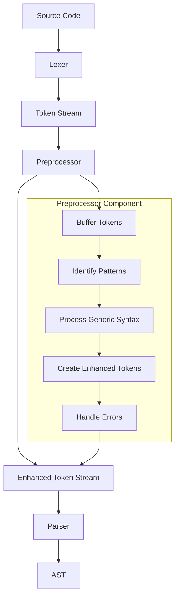
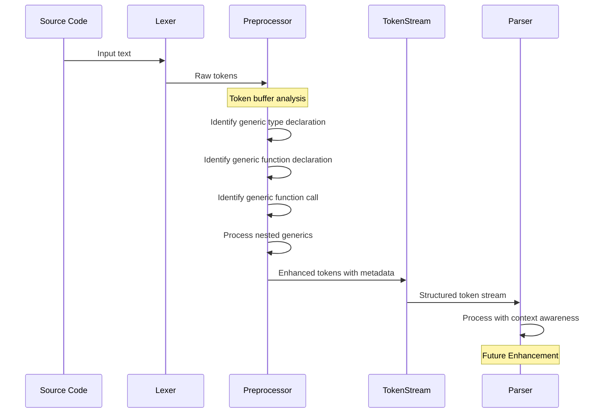
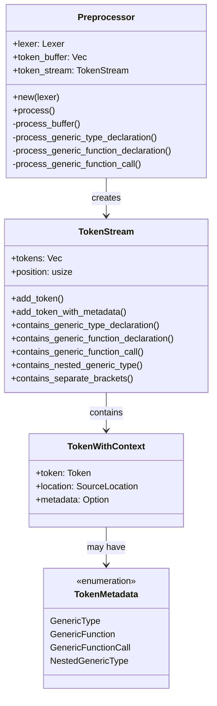

# Generic Syntax Preprocessor

This document describes the preprocessor implementation for handling generic syntax in the CURSED programming language.

## Processing Flow

The preprocessor sits between the lexer and parser, enhancing tokens with contextual information about generic syntax.



## Token Processing Sequence

The following sequence diagram shows how tokens flow through the system:



## Component Structure

The preprocessor consists of several components working together:



## Generic Syntax Support

The preprocessor handles the following generic syntax patterns:

1. Generic type declarations:
   ```
   be_like Box[T] squad { ... }
   ```

2. Generic function declarations:
   ```
   slay foo[T](x normie) T { ... }
   ```

3. Generic function calls:
   ```
   foo[normie](42)
   ```

4. Nested generic types:
   ```
   be_like Pair[K, V[T]] squad { ... }
   ```

## Error Handling

The preprocessor provides detailed error messages for malformed generic syntax:

- Unclosed type parameter brackets
- Unexpected tokens in generic declarations
- Missing required tokens after type parameters